# Canonical Business Rules Management & Delivery Platform — Architecture

> **Status (2026-07-23): small-first reset.** Existing control-plane, adapter,
> governance, generation, and delivery components are retained, but the active
> architecture target is one useful Java repository round trip followed by one
> small cloud-PostgreSQL table round trip. Container hardening, multi-site scale,
> heavyweight analysis, and Internet-production concerns are historical or
> deferred capabilities, not MVP prerequisites. See `prd.md` and the active
> roadmap at the top of `IMPLEMENTATION_PLAN.md`.

## 0. Relationship To The Knowledge Assistant

The Telecom Business Knowledge Assistant PRD (`../agent_testcase/services/knowledge-api/prd.md`, especially §4.10) provides product context for why this track exists, but it is not this application's executable specification. It confirms that PGM source generation is a larger, deferred, separately designed capability and that a PGM may map to a screen, batch job, interface, API, or service.

This platform therefore adopts the knowledge product's useful trust principles — evidence provenance, Korean preservation, review before activation, versioned regression sets, and configuration-driven extensibility — without reusing or depending on its chat, RAG ingestion, vector retrieval, Neptune schema, document chunks, or citation API. A manual-document adapter may consume exported source evidence through its own contract; it must not make the knowledge assistant a runtime dependency.

## 1. Active Design Constraints

| Constraint | Source |
|---|---|
| First delivery path = deterministic generated Java, target tests, pushed branch, and reviewable pull request | PRD §5.4/§7 |
| First input = one public, small Java repository; second input = one selected small cloud-PostgreSQL table | PRD §5.2/§5.5 |
| Business users author a Canonical Decision Package; executable Rule IR is compiled, not hand-edited | ADR-9 |
| Source extraction is candidate-only and evidence-backed; approval and production artifacts are deterministic | ADR-4/6/8/10 |
| Java 17 and PostgreSQL are the only active language/database targets | Active roadmap |
| Local API, worker, UI, Git, Java, and cloud PostgreSQL must be sufficient; Docker and Joern are optional | Active roadmap |
| Scale and heavyweight tooling require a demonstrated failure, not an assumed repository size | ADR-10 |

## 2. Architecture Decision Records

### ADR-1 — Rule IR is the only executable canonical representation

**Decision.** The platform owns a lightweight, vendor-neutral **Canonical Rule IR** (§5). It is the only executable canonical representation. The governed user-authored source is the Canonical Decision Package introduced by ADR-9, which compiles deterministically to IR. JDM, DMN, DRL, Java source, and every other engine/language format are derived adapters; never store an engine-native or generated format as truth.

**Rationale.** (i) The product must ingest many input kinds (DB tables, stored objects, Java/UI code metadata, manuals, DMN/DRL assets) and emit many targets (Java, C#, JDM, DMN) — only a neutral hub format keeps that M×N problem at M+N adapters. (ii) JDM is one vendor's format; making it the internal model silently shapes the whole product around one engine even though half the delivery story is generated source. (iii) Full DMN/DRL/ODM semantics are too broad to generate safe code from, and lack the metadata we need (source traceability, confidence, approval status, generator/deploy metadata). (iv) Codegen needs a *restricted, deterministic* rule profile — that restriction is easiest to enforce in a format we own.

**Consequences.** Package and IR schemas plus their compiler are versioned responsibilities (§5/ADR-9). Business governance and readable diff operate on package revisions; execution conformance and target generation operate on compiled IR. Every new engine or language remains an adapter, not a new source of truth.

### ADR-2 — A and B are per-site delivery modes over one IR, not an architecture fork

**Decision.** "Externalization" (A: system calls our engine at runtime) and "code generation" (B: generated source is the runtime) are both **target paths from the same approved IR**, chosen per site:

- **Mode B** — sites whose logic was buried in source code. This is the only active delivery path.
- **Mode A** — sites migrating off an existing third-party engine. It is an implemented historical capability and a deferred product path.

**Consequences.** No engine is required for the active Mode-B MVP. If a real engine-migration case later activates Mode A, the existing IR→JDM and Zen components can be evaluated without changing the package/IR/generation boundary.

### ADR-3 — Do not add another authoritative evaluator

**Decision.** Do **not** build an internal Rule-IR evaluator in the MVP. Existing GoRules Zen preview may remain available as advisory feedback, but it is not required for the active flow. Mode-B validation compiles and executes generated Java plus target tests.

**Rationale.** A bespoke evaluator would add another execution semantics that can disagree with the code that actually ships. Business scenarios should be rendered into authoritative generated-Java tests for the active path.

**Consequences.** Any Zen result is labeled advisory. The **authoritative golden tests compile and execute generated Java** (§7), and target-application tests must pass before a branch is pushed.

### ADR-4 — Production code generation is deterministic; LLMs are confined to mining

**Decision.** Target generators are **AST/template-based and deterministic**: the same recorded ADR-8 `ReleaseInput` produces byte-identical output. Decision-source generation depends on approved IR content; generated golden tests and the release manifest additionally depend on the governed suite, lookup snapshots, target config, and generator version recorded in `ReleaseInput`. LLMs participate only in **extraction** (turning legacy logic into *candidate* rules that humans review); no LLM-generated text ever flows into production artifacts.

**Rationale.** Finance/insurance compliance requires reviewable, reproducible, auditable output. Recording every behavior-affecting input avoids the false claim that mutable golden cases or lookup data are implied by IR alone. Determinism also makes generated-code diffs meaningful in PR review (§7.3).

### ADR-5 — Polyglot split: Python platform core, Java-native generation toolchain

**Decision.** Platform services (adapter orchestration, rule-repository API, governance backend, decision service) are **Python/FastAPI**. Artifact-facing Java work — the source generator, seam cut-over recipes, golden-test rendering — is a small **Java toolchain** (JavaPoet + OpenRewrite + google-java-format) packaged as a versioned CLI the platform invokes (JSON IR in → files out).

**Rationale.** (i) Team competency: this workspace already runs a FastAPI backend and a Vue frontend — same stack, faster delivery, one hiring profile. (ii) GoRules Zen ships an official **Python** binding (also Rust/Node/Go) but **no official Java binding** — embedding Zen for preview is natural from Python. (iii) LLM/mining tooling is Python-native. (iv) But *generating and refactoring Java* is safest with Java-native AST tools — hand-rolled Java emission from another language is where codegen bugs breed.

**Consequences.** Two build systems (uv + Gradle), kept decoupled by the CLI contract. Because Zen has no official Java binding, mode-A delivery for Java legacy sites runs as a thin **sidecar decision service** (FastAPI + embedded Zen) rather than in-process — acceptable, and consistent with how their previous third-party engines were typically deployed.

### ADR-6 — Repository lifecycle is a governed envelope around immutable IR content

**Decision.** The canonical decision content does not contain repository revision or lifecycle status. PostgreSQL stores an immutable content snapshot plus a governed revision envelope:

```text
DecisionRevision:
  decision_key, revision, content, content_hash
  lifecycle_status, effective_from, effective_to
  created_by, submitted_by, approved_by, rejected_by
  created_at, submitted_at, decided_at
```

Content, revision identity, and effective interval are never updated. Submit/approve/reject/retire operations append lifecycle events and update only a transactional current-state projection on the revision envelope; generated content is always loaded through an envelope whose projected status is `APPROVED`. The event log is authoritative for lifecycle history. The API never accepts client-supplied revision or lifecycle fields inside IR content.

**Rationale.** Embedding `status` and `version` inside JSON while also storing them in relational columns creates two competing truths. Separating the governed envelope from vendor-neutral decision content preserves deterministic generation while keeping workflow queries and constraints explicit.

**Effective dating.** Approval rejects overlapping approved effective intervals for the same decision key and release channel. Generation requires either an explicit revision or an `as_of` timestamp; an implicit request resolves the one approved revision effective at that timestamp, never merely the greatest revision number.

### ADR-7 — IR v1 has fully specified, cross-target execution semantics

**Decision.** IR v1 uses typed operands and assignments, not language expressions. Operators are `EQ`, `NE`, `GT`, `GTE`, `LT`, `LTE`, `IN`, `NOT_IN`, `BETWEEN`, `EXISTS`, and `STARTS_WITH`. Scalar types are `boolean`, `integer`, `decimal`, `string`, and `date`; list values are homogeneous lists of those scalar types. Java decimal generation uses `BigDecimal`, and dates use `LocalDate`.

An operand is one of:

- `INPUT(name)` — a declared, Java-safe logical input name; optional `sourcePath` records the legacy dotted/property path.
- `LITERAL(value)` — a typed JSON literal.
- `LOOKUP_FIELD(lookup, keys, field)` — a declared lookup, input/literal key bindings, and one selected field.

`EXISTS` is unary. `IN`/`NOT_IN` require a non-empty homogeneous list. `BETWEEN` requires exactly two ordered values. `STARTS_WITH` accepts strings only. Validation rejects any operator/type combination not defined by the profile.

Actions remain deterministic `SET(output, literal)` assignments. Legacy increments and collection mutations are represented as independent `COLLECT` decisions rather than side effects. `FIRST` and `UNIQUE` return one typed output record and require `defaultOutput` for no-match behavior; `UNIQUE` fails if more than one rule matches. `COLLECT` returns an ordered list of typed output records and returns an empty list when nothing matches. A site composition specification may deterministically combine decision outputs using only the v1 aggregators `SUM`, `DISTINCT`, and `FIRST_NON_NULL`; the generated façade implements that composition.

**Authority.** The Pydantic validator, JDM exporter, Zen preview, Java generator, and consistency suite must implement these semantics from one checked-in conformance corpus. A profile extension is not accepted until all active targets pass the same corpus.

### ADR-8 — Delivery inputs and validation evidence are versioned

**Decision.** A generated release is identified by all behavior-affecting inputs, not IR alone:

```text
ReleaseInput = decision content hash
             + decision revision/effective interval
             + approved golden-suite revision/hash
             + lookup snapshot ids/hashes used by tests
             + site target/composition config hash
             + generator version
```

Golden suites are immutable, versioned records with case provenance. Lookup data used by tests is exported to immutable snapshots; production lookup providers may remain live, but the release gate always records the tested snapshot. The artifact manifest contains every input hash and every output hash.

**Delivery ordering.** The one-time integration seam is landed and verified on the target repository's baseline before recurring delivery begins. Each delivery branches from that seam-enabled baseline, generates code and tests, compiles and runs generated Java, runs target-application regression tests through the façade, emits a semantic diff, and only then commits/pushes or opens a review request. The Phase-1 fixture uses a local bare remote and PR-equivalent review report so the complete branch flow is testable without external credentials.

### ADR-9 — Separate business authoring from executable Rule IR

**Decision.** The governed user-facing object is a **Canonical Decision Package**. It contains vocabulary, business decision tables, lookup definitions, composition, effective dates, business scenarios, source evidence, and technical target bindings. A deterministic compiler validates the package and produces the existing restricted Rule IR. Rule IR remains the sole executable canonical representation, but it is not the primary non-technical editing surface.

**Rationale.** The current IR is suitable for machines and deterministic generators, but exposing `when`/`then` operand JSON makes business ownership nominal rather than real. A business author needs domain labels, rows, outcomes, scenarios, and actionable validation. Separating the two models preserves strict generation semantics without forcing UI users to understand execution internals.

**Consequences.** Raw IR editing moves behind an advanced/debug mode. Package-to-IR compilation is versioned and deterministic. Compilation diagnostics point to a vocabulary field, decision-table cell, lookup, composition step, or scenario. Provenance and governance are retained across compilation; generated artifacts still consume only an approved revision envelope.

### ADR-10 — Progressive evidence analysis, not Joern-first mining

**Decision.** Small-repository extraction uses the least expensive tool that can produce adequate evidence:

1. pin the Git commit; inventory files/manifests; use `rg`, `git`, and bounded reads;
2. use Tree-sitter or an equivalent syntax query for structural ambiguity;
3. use JavaParser/SymbolSolver, OpenRewrite, or JDT LS when symbol, type, reference, or call-hierarchy evidence is necessary;
4. consider Joern/SootUp only after the run records a concrete unresolved case and why the lighter tiers cannot answer it;
5. route remaining ambiguity to human review.

An LLM/agent may select and call these read-only evidence tools and propose candidates. It must return a validated `EvidenceBundle`: pinned commit and subpath, hypothesis, exact source spans and hashes, inferred inputs/outputs/rows, test evidence, assumptions, unresolved calls/fragments, confidence per field, tool transcript, and escalation recommendation.

**Rationale.** Repository size alone does not establish semantic difficulty. Whole-program graph construction adds cost and operational risk before the first small repository has proved product value. Lightweight search plus bounded semantic escalation is easier to inspect and is sufficient for many small rule repositories.

**Consequences.** Joern is removed from the base runtime and local-development prerequisites. There is no graph database or heavyweight worker in the active MVP. Heavy analysis is an optional, ephemeral capability whose value must be demonstrated on a real failed case. Fixed synthetic regex/templates remain test fixtures, not evidence of general Java extraction.

## 3. System Overview

```mermaid
flowchart LR
    subgraph IN["Bootstrap inputs"]
        A1["Small public Java repository"]
        A2["Selected PostgreSQL table - next slice"]
    end
    subgraph EA["Evidence acquisition"]
        B1["git + rg + bounded reads"]
        B2["Syntax and semantic escalation on demand"]
        B3["EvidenceBundle + candidate package"]
    end
    subgraph CP["Canonical Decision Package"]
        C1["Vocabulary + decision tables + lookups"]
        C2["Business scenarios + evidence + governance"]
    end
    subgraph EX["Deterministic execution layer"]
        D1["Package compiler"]
        D2["Executable Rule IR"]
        D3["Java + JUnit generator"]
    end
    E["Compile + generated tests + target tests"]
    F["Push branch + create reviewable PR"]

    A1-->B1-->B2-->B3
    A2-->B3
    B3-->C1-->C2
    C2-->D1-->D2-->D3-->E-->F
    F-."source drift / reconciliation".->B1
```



The Canonical Decision Package is the product hub. Bootstrap inputs propose it; business users own it; the compiler and generators consume only approved versions. A pull request is the MVP delivery boundary. Merge and production deployment remain outside the platform's authority.

## 4. Component Responsibilities

| # | Component | Responsibility | Explicitly NOT its job |
|---|---|---|---|
| ① | Evidence acquisition | Produce evidence-backed candidate packages from a pinned repository or selected DB table | Approving candidates; inventing unsupported semantics |
| ② | Canonical Studio | Let business authors edit vocabulary, tables, lookups, dates, and scenarios; use GoRules JDM Editor as a constrained decision-table widget | Requiring raw IR/JSON for normal edits; making JDM or GoRules BRMS the source of truth |
| ③ | Package repository | Store immutable package revisions, evidence, lifecycle, and audit history | Treating generated code or engine formats as truth |
| ④ | Package compiler | Deterministically validate and compile an approved package to Rule IR | Calling an LLM or silently repairing invalid business content |
| ⑤ | Target generators | Deterministically render Java, JUnit, and release evidence from approved inputs | Free-form source generation or choosing approval state |
| ⑥ | Delivery | Run generated/target tests, push a branch, and open a reviewable PR | Auto-merging or claiming production deployment |

## 5. Canonical Rule IR v1

### 5.0 Canonical Decision Package and compilation boundary

The user-facing package sits above Rule IR and is stored as an immutable governed revision. Its minimum logical sections are:

```text
CanonicalDecisionPackage:
  vocabulary[]          # business label, type, optional technical binding
  decisions[]           # readable table columns, rows, outcomes, hit policy
  lookups[]              # business definition + provider/snapshot binding
  composition            # restricted deterministic decision composition
  businessScenarios[]   # input + expected business outcome + provenance
  evidenceBundles[]      # immutable source evidence and uncertainty
  targetBinding          # Java package, seam, generated/test paths, commands
```

`compile(packageRevision) -> RuleIR[] | PackageDiagnostic[]` is pure and versioned. It resolves vocabulary references, validates table cells and operator/type compatibility, checks required outcomes and restricted composition, attaches evidence to the corresponding IR rules, and emits no partial executable output when an error exists. Lifecycle and effective dates remain in the governed revision envelope per ADR-6. The advanced UI may display compiled IR, but direct IR editing is not the normal authoring path.

The Studio embeds `@gorules/jdm-editor` as a lazy-loaded React island inside the Vue application. A restricted adapter projects one Canonical Decision Package table into JDM for editing and validates the edited JDM back into the package. Only the supported literal/operator subset crosses this boundary; arbitrary Zen expressions, column-schema changes, lifecycle state, evidence metadata and governance never do. This deliberately reuses GoRules' mature spreadsheet UX without adopting GoRules BRMS or changing canonical authority.

### 5.1 Profile and invariants

The v1 profile admits only structures that every active executor can review and implement identically:

- decision-table condition/action rules;
- the typed operators and operands defined by ADR-7;
- `all`/`any` condition groups, with maximum nesting depth 3;
- hit policies `FIRST`, `UNIQUE`, and `COLLECT`;
- declared lookup references with explicit key bindings and selected fields;
- deterministic output assignment and the three site-composition aggregators in ADR-7;
- no inline SQL, arbitrary calls, side effects, full FEEL, or language snippets.

Anything an adapter cannot express becomes a review-queue item containing the raw fragment, exact provenance, reason code, and adapter version. It is never silently dropped or coerced. A profile extension requires schema migration plus conformance tests for Pydantic, JDM/Zen, and every active target generator.

### 5.2 Decision content shape

Repository status, revision, actors, and effective dates are deliberately absent from this content object; ADR-6 places them in the governed revision envelope.

```json
{
  "decisionId": "enrollment_eligibility",
  "decisionName": "가입 자격 판정",
  "profile": "RULE_IR_V1",
  "schemaVersion": 1,
  "product": "CANCER_BASIC",
  "programContexts": [
    { "programId": "ENROLLMENT-API", "kind": "API",
      "entryPoint": "legacy.EnrollmentValidator#evaluate" }
  ],
  "hitPolicy": "FIRST",
  "inputs": [
    { "name": "age", "sourcePath": "customer.age", "type": "integer", "required": true },
    { "name": "regionCode", "sourcePath": "customer.regionCode", "type": "string", "required": true }
  ],
  "outputs": [
    { "name": "eligible", "type": "boolean" },
    { "name": "reasonCode", "type": "string" }
  ],
  "defaultOutput": { "eligible": true, "reasonCode": "ELIGIBLE" },
  "lookups": [
    { "name": "region_eligibility", "ref": "lookup://region_eligibility" }
  ],
  "rules": [
    {
      "ruleId": "R001",
      "when": {
        "all": [
          { "left": { "kind": "INPUT", "name": "age" },
            "operator": "LT",
            "right": { "kind": "LITERAL", "value": 18 } }
        ]
      },
      "then": [
        { "output": "eligible", "value": false },
        { "output": "reasonCode", "value": "UNDER_AGE" }
      ],
      "origin": "EXTRACTED",
      "sourceReferences": [
        { "type": "JAVA_SOURCE", "repository": "legacy-enrollment", "revision": "abc123",
          "file": "src/main/java/legacy/EnrollmentValidator.java",
          "lineStart": 24, "lineEnd": 29 }
      ],
      "confidence": 0.82
    }
  ]
}
```

Logical names such as `age` must be valid identifiers in every active target language. `sourcePath` preserves the legacy property path without leaking language syntax into execution semantics.

### 5.3 Provenance and authored rules

Every rule has an `origin`:

- `EXTRACTED` requires one or more source references and `confidence` in `[0,1]`.
- `USER_AUTHORED` requires a `USER_ACTION` reference containing actor, timestamp, and reason; confidence is omitted because it is not an extraction score.

Source references are discriminated records, not a generic file/line structure:

- `JAVA_SOURCE`: repository, immutable revision, file, line range, optional symbol.
- `DB_ROW`: connection alias, schema, table, primary-key JSON, snapshot id/hash.
- `MANUAL_DOC`: document id/revision and page, slide, sheet, section, or cell range.
- `DMN_ASSET`: repository/object id, immutable revision, decision id, and element id.
- `USER_ACTION`: actor, timestamp, and reason.

This follows the knowledge product's trust model: an evidence pointer identifies the exact source revision and location, not merely a filename. Korean text is preserved byte-exact through source evidence, content JSON, database storage, previews, generated strings, and reports.

### 5.4 Revision lifecycle and maker-checker

Revision-envelope states are:

```text
DRAFT → SUBMITTED → APPROVED | REJECTED
APPROVED → RETIRED
```

The revision creator is the maker. Submit is allowed only by the maker or a configured delegate. Approve/reject requires an authenticated actor different from both creator and submitter; Phase 1 uses a development actor header, but the service rule is the same. Every transition appends an audit event with actor, timestamp, previous/new state, reason, content hash, and request correlation id.

An approved revision is immutable. Editing it creates a new `DRAFT` revision. Approval also validates effective-date overlap and requires an approved golden-suite revision.

### 5.5 Schema evolution and conformance

`profile` plus `schemaVersion` gate every reader and writer. Migrations are forward-only scripts checked into this repository. Adapters and generators declare supported profile/version ranges. `tests/conformance/` contains canonical inputs and expected results shared by the Pydantic model, JDM/Zen evaluator, Java generator, and consistency runner.

## 6. Source Adapters

### 6.1 Contract

```text
SourceAdapter:
  discover(siteConfig)              -> Source[]           # what's there to extract
  extract(source)                   -> ExtractionBatch    # candidate package + EvidenceBundle + review items
  # every inferred field carries evidence/confidence; nothing is auto-approved
```

The active adapters are `code-java-agent` and, after the repository slice passes, `db-postgres-table`. Previously implemented restricted adapters remain available as historical proofs but are not active roadmap dependencies. Unknown or unavailable capabilities stop orchestration before extraction or generation. Credentials are referenced, never embedded in profiles or evidence.

### 6.2 `db-postgres-table` — second vertical slice

Deterministic ETL maps explicitly selected condition and outcome columns through a reviewed mapping spec; each selected row becomes a candidate decision-table row. A `DB_ROW` reference records connection alias, schema/table, primary-key JSON or stable row identity, selected columns, and snapshot hash. The adapter never embeds credentials or lets an LLM submit arbitrary SQL.

The connector authenticates with a database role that has `SELECT`/metadata permissions only. Transaction read-only mode is defense in depth, not the primary control. Dynamic identifiers are resolved from catalog-discovered allowlists and quoted by the driver; tests attempt writes and identifier injection and must prove both are rejected.

### 6.3 `code-java-agent` — first vertical slice

```text
public GitHub URL + revision + optional subpath/entry hint
    → credential-free clone and immutable commit pin
    → manifests and repository inventory
    → git/rg search and bounded source/test reads
    → syntax query when text evidence is insufficient
    → symbol/type/reference query only for unresolved dependencies
    → structured candidate package + EvidenceBundle + review items
    → schema/package validation → PENDING_REVIEW
```

The agent is an orchestrator over read-only evidence tools, not an authority. Tool requests and returned spans are bounded and recorded. The model receives only the necessary evidence and must return structured output. Each candidate field points to supporting spans/hashes or is marked as an assumption; unresolved calls and alternative interpretations remain visible to the reviewer.

Tree-sitter is the first structural escalation. JavaParser/SymbolSolver, OpenRewrite, or JDT LS may be invoked for targeted semantic questions. Joern/SootUp is an optional final escalation and is not installed, started, or required by the base workflow. Repository size alone is never an escalation reason.

### 6.4 `engine-dmn` — external-engine import

`DMN 1.3+ asset → parse decision tables → Canonical Rule IR candidate`. The implemented subset maps input columns to conditions, output columns to actions, and `FIRST`/`UNIQUE`/`COLLECT` hit policies to IR. Literal equality, comparisons, inclusive ranges, lists, and `not(...)` map to typed IR operators. Every imported rule retains asset id, immutable revision, decision id, and exact rule-element id; Korean text remains UTF-8. Unsupported FEEL and non-table boxed expressions become review items rather than guessed rules. DTD/entity declarations are forbidden, and **BPMN is rejected** because workflow orchestration is not a rule table. DRDs and full FEEL remain outside the profile. Phase 3 adds a separate restricted DRL adapter; ODM artifacts are classified and routed to customer-mapping review rather than guessed.

### 6.5 Stored-object and UI validation sources (historical/deferred)

The stored-object adapter consumes source only through the bounded connector allowlist. It recognizes a deliberately small PL/pgSQL function form: typed scalar parameters, ordered `IF`/`ELSIF` comparisons, literal `RETURN` values, and one literal `ELSE` default. Any assignment, call, loop, SQL statement, compound condition, or unsupported type invalidates the whole object and creates a review item. Candidates carry connection alias, schema/object, content hash, and exact line provenance.

The UI adapter uses a non-executing HTML parser. Numeric `min`/`max` plus explicit `data-rule-eq`/`data-rule-in` metadata can become candidate validations. Native `required`/`pattern`, event handlers, scripts, and framework expressions are review items; JavaScript is never evaluated. This is static declarative metadata coverage, not arbitrary UI-code mining.

### 6.6 Engine-native boundary (historical/deferred)

The restricted DRL importer accepts one fact pattern containing literal field comparisons and consequences containing only literal `result.setX(...)` assignments. It requires one unconditional default, preserves rule/asset/hash/line provenance, and routes unsupported attributes, conditions, or consequences to review. ODM has no safe generic interchange shape without customer product/version artifacts, so it is identified and stopped at `ODM_FORMAT_REQUIRES_CUSTOMER_MAPPING`. BPMN remains rejected.

### 6.7 `docs-manual` — manuals (historical/deferred)

Rule-oriented extraction to IR shape. May borrow low-level document-parsing utilities from the knowledge-assistant codebase, but not its RAG ingestion/output (different contract — see PRD §2). Used to *corroborate or fill gaps* in mined rules; low confidence by default.

## 7. Target Generators

### 7.1 Contract

```text
TargetGenerator:
  supports(profile, targetConfig)   -> bool
  generate(releaseInput)            -> GeneratedArtifact   # deterministic (ADR-4/8)
```

Implemented target packages are `java-source`, `jdm-export`, `test-generator`, restricted `dmn-export`, and `csharp-source`. Report generation remains later/customer-driven.

### 7.2 `java-source`

- Renders each independently evaluated decision to a self-contained Java class using JavaPoet and the ADR-7 type mapping.
- `FIRST`/`UNIQUE` classes return one output record and use the required `defaultOutput` on no match. `COLLECT` classes return `List<Output>` in rule order. `UNIQUE` throws a typed multiple-match exception.
- Lookup operands call a generated `LookupProvider` contract with declared key bindings; lookup results are type-checked before operator evaluation.
- A generated or hand-reviewed site façade composes multiple decisions using only configured `SUM`, `DISTINCT`, and `FIRST_NON_NULL` aggregators. Site composition lives in target config, not in core generator branches.
- Generated code is **owned by the generator**: it lives in a marked package (e.g. `…rules.generated`), carries `@Generated` plus decision/revision/content-hash headers from the release manifest, and is **never hand-edited** — regeneration is the only write path.
- Lookup access goes through a thin provided interface (site supplies the implementation), so generated code stays free of DB/framework coupling.

### 7.3 Delivery flow (mode B)

```text
one-time: land and verify façade seam on target baseline
recurring: approve revision + golden suite → generate from recorded ReleaseInput
        → compile + generated-Java golden tests + target regression tests
        → diff vs previous generated source → commit/push → GitHub PR
```

For the active MVP, successful delivery ends at a remotely pushed branch and a reviewable pull request in the writable dummy repository. A local branch, artifact, or PR-equivalent report is useful diagnostic evidence but is not full-flow acceptance. Merge and downstream production deployment remain human/target-CI responsibilities and are not performed or claimed by this platform.

### 7.4 `jdm-export` (implemented but deferred)

IR→JDM is intentionally trivial because the IR v1 profile is a strict subset of what JDM expresses. The same export feeds (a) the embedded-Zen preview in governance and (b) the mode-A production runtime.

Mode-A activation is an append-only publication operation, not a mutable "active" flag. A publish request is serialized per decision and succeeds only when the decision revision is `APPROVED` and effective, the selected golden-suite revision is `APPROVED`, and every case passes Zen with `authority = AUTHORITATIVE`. The publication records the decision/suite hashes, exact JDM document/hash, lookup-snapshot hashes, validation result, actor, channel, and previous publication. Active resolution selects the newest publication for the decision/channel. Rollback reruns the target's immutable golden evidence and appends a new publication referencing both the current and previously validated publication; history is never rewritten.

### 7.5 `test-generator`

Golden suites are governed inputs rather than incidental database rows. Each immutable suite revision contains curated input/expected-output pairs, case provenance, decision-key coverage, and lookup-snapshot references. Suites are seeded from legacy behavior during initial load and extended through maker-checker review. The same suite renders as JUnit against generated Java (mode B) and as Zen evaluation fixtures (mode A), but only the executor named by §9 is authoritative.

### 7.6 Historical/deferred DMN and C# targets

`dmn-export` deterministically emits DMN 1.3 decision tables only where a flat IR condition group maps to one unary-test cell per input. It covers equality/inequality, ordering, ranges, and lists; lookup operands, `EXISTS`, `STARTS_WITH`, nested `any`, and multiple conditions for one cell fail explicitly. Provenance is written as deterministic extension metadata, repository lifecycle fields are excluded, and export→import semantic projections are byte-equal.

`csharp-source` deterministically emits typed records, all IR-v1 operators/hit policies, a lookup-provider contract, xUnit golden source, and an ADR-8 manifest. It is a **source-generation plug-in proof** on the current host: because no .NET SDK is installed, compile evidence is `COMPILE_NOT_RUN`. C# cannot become an authoritative Mode-B delivery target until a pinned SDK and target repository compile/run its generated golden suite.

## 8. The Mode-B Integration Seam (initial-load cut-over)

Generating a rule module is not enough — legacy code must *call* it, or edited rules regenerate a module nothing executes. Per site, once:

1. Mining identifies the sliced region(s) in legacy source (§6.3 gives exact file/line).
2. Engineers replace each region with a call to the generated module behind a thin façade (`EnrollmentRuleModule.evaluate(input) -> decision`) — a **one-time, human-reviewed surgical change** (this is SI-phase work, consistent with the customer's framing).
3. The seam branch runs shadow/regression tests and is merged into the delivery baseline before the first recurring rule delivery.
4. From then on, the façade is the stable boundary: regeneration changes what's *behind* it, never the call sites.

Verification of the cut-over: golden tests seeded from pre-cut-over behavior plus target-application regression tests through the façade (shadow comparison where feasible — run old path and new module side by side on sampled inputs; the customer indicated a product-management rule DB can serve as corroborating evidence). The end-to-end demo executes the target application from the delivered branch; a Zen preview result is not accepted as proof of Mode-B delivery.

## 9. Execution & Validation Authority

| | Preview (governance UI) | Authoritative validation | Production |
|---|---|---|---|
| **Mode B** | IR→JDM→embedded Zen (advisory) | Golden tests compiled & run against **generated Java** | Generated source in site's app |
| **Mode A** | Same Zen path (= production semantics) | Golden tests run on **Zen runtime** | Zen engine service |

The asymmetry is deliberate (ADR-3): in mode B there are two executors (Zen preview, generated Java), so exactly one — the one that ships — is the authority. Any preview-vs-authority divergence found by golden tests is a generator bug to fix, tracked as such.

## 10. Small-Flow Runtime And Configuration

- **Runtime:** local FastAPI API, one durable worker, Vue UI, Git, Java 17, and the existing cloud PostgreSQL are sufficient. Docker is not required.
- **Repository input:** public HTTPS GitHub URL, revision, optional safe subpath, bounded entry-point hint, and immutable resolved commit.
- **Target binding:** writable repository/credential reference, base branch, generated/test paths, Java package, stable façade seam, build/test commands, and pull-request provider settings.
- **PostgreSQL input:** a separate read-only source connection reference plus an allowlisted schema/table/view and reviewed column mapping. Platform persistence and source-rule access are distinct configurations even when hosted on the same server.
- **Durable orchestration:** existing jobs, candidates, artifacts, releases, and worker leases are reused. A new heavyweight queue/service is not introduced for the MVP.
- **Optional capabilities:** Zen, DMN/DRL, C#, SQLite portability, stored objects, UI validation, OIDC, multi-site controls, containers, and Joern remain dormant unless an active roadmap task explicitly needs them.

## 11. Risks & Mitigations

| Risk | Mitigation |
|---|---|
| Extraction proposes wrong or incomplete rules | EvidenceBundle per field; candidate-only + mandatory review; unresolved fragments stay visible; business and target tests gate delivery |
| Business authoring remains technical | Package/IR separation (ADR-9); decision-table and vocabulary UI is the acceptance surface; JSON is advanced-only |
| Lightweight analysis cannot resolve a dependency | Record the failed question and escalate one tier at a time per ADR-10; human review remains the final tier |
| Preview vs production semantic drift (mode B) | Authority rule (§9); divergences = generator bugs; deterministic generation makes them reproducible |
| FEEL / complex DMN beyond IR profile | Restricted profile + review queue with raw fragment attached; profile grows only when all generators support it (§5.1) |
| Integration seam underestimated | Named Phase-0/1 deliverable (§8); designed against real sample code, not in the abstract |
| Package/IR semantics drift | Versioned deterministic Package→IR compiler plus shared conformance and generator tests (§5.0/§5.5) |
| Engine decision reversal | Engine sits behind IR + `jdm-export`; swap = new export adapter + runtime packaging, upstream untouched (ADR-1/2) |
| Repository row status diverges from content JSON | Lifecycle/revision metadata lives only in the ADR-6 envelope; content hashes are immutable |
| Same rule produces different release evidence | ADR-8 manifest hashes golden-suite, lookup snapshot, site config, generator, content, and outputs |
| Delivery branch is not the code actually executed | Seam is merged into the baseline first; target regression tests run from the generated delivery branch |

## 12. Phase Mapping (deliverables)

| Phase | Deliverables |
|---|---|
| **0 — Cloud-local truth** | Start API/worker/UI without Docker against cloud PostgreSQL; verify migrations, health, worker freshness, and safe test isolation |
| **1 — Canonical Studio** | Canonical Decision Package persistence/compiler; vocabulary/table/lookup/scenario editor; readable validation/diff; governed approval; advanced-only raw IR |
| **2 — Small Java repo full-flow** | Public-repo import; EvidenceBundle agent; candidate review/edit; deterministic Java/JUnit; generated and target tests; changed outcome; pushed branch and GitHub PR |
| **3 — Small PostgreSQL table full-flow** | Guided read-only table selection/mapping; DB evidence; reuse the same package, approval, generation, tests, and PR delivery |
| **4 — Evidence-triggered expansion** | Add only the smallest semantic, scale, runtime, language, DBMS, security, or packaging capability required by a demonstrated blocker |

## 13. Technology Stack And Libraries

Concrete choices for the active small-flow path are listed first. Historical/deferred components remain in the codebase but are not prerequisites.

### 13.1 Platform core

| Component | Primary choice | Notes / alternatives |
|---|---|---|
| Platform API & orchestration | **Python 3.12 + FastAPI + Pydantic v2** | IR schema = Pydantic models (JSON Schema exported from them — one definition, validated everywhere). Matches existing team stack. |
| Rule repository storage | **Existing cloud PostgreSQL** — immutable package/IR content, revision envelopes, lifecycle events, versioned scenarios/golden suites, and audit tables; SQLAlchemy + Alembic | No local Docker PostgreSQL requirement. Automated destructive tests use an isolated test DB/schema only. |
| Governance UI | **Vue 3 + TypeScript + Vite + Pinia** | Decision-table/vocabulary/scenario editing is primary. Monaco/raw JSON is advanced/debug only. |
| AuthN/Z | **Existing local development actors and maker-checker invariant** | Production OIDC is retained but deferred; it does not block dummy-repository full-flow acceptance. |
| Local runtime | **Native API + worker + UI** using `uv`, `pnpm`, Git, and Java 17 | Docker Compose and Kubernetes are optional packaging work, not active prerequisites. |
| Observability | structlog (JSON logs); OpenTelemetry optional per site | Keep light. |

### 13.2 Source adapters (extraction)

| Adapter | Primary choice | Notes / alternatives |
|---|---|---|
| `code-java-agent` | **Git + ripgrep + bounded reader**, then **Tree-sitter**, then targeted **JavaParser/OpenRewrite/JDT LS** | Progressive evidence tiers per ADR-10. The base flow must work without Joern. |
| Structured candidate extraction | Provider-swappable LLM/agent behind validated schemas | Consumes bounded evidence and returns candidate package + EvidenceBundle only. It never writes production Java. |
| Heavy semantic escalation | **Joern or SootUp, optional and ephemeral** | Allowed only after a recorded lightweight failure shows why it is needed. Not part of base Compose/runtime. |
| `db-postgres-table` | Existing bounded connector contract + **psycopg 3** | Read-only allowlisted catalog/table access; no model-authored arbitrary SQL. Second DBMS support is deferred. |
| Historical adapters | Existing DMN/DRL/stored-object/UI/manual/SQLite proofs | Retained and tested where practical, but not active full-flow dependencies. |

### 13.3 Target generators & delivery

| Component | Primary choice | Notes / alternatives |
|---|---|---|
| `java-source` generator | **Java 17 toolchain: JavaPoet** (AST-safe class generation) + **google-java-format** (deterministic formatting) — packaged as a Gradle-built CLI: release manifest + JSON IR in → `.java` out | JavaPoet is the Phase-1 choice. Site-specific style differences are formatter/import/package configuration, not alternate free-form templates. |
| Integration-seam cut-over (§8) | Targeted human-reviewed edit; **OpenRewrite** may assist when useful | The dummy repository must contain a stable seam before recurring generation. |
| `test-generator` | JUnit 5 sources via the same Java toolchain; JSON fixtures for Zen (mode A) | Golden-test authority per §9. |
| Deferred targets | Existing JDM/DMN/C#/Zen components | Historical capabilities; not required for Java-repository MVP acceptance. |
| Delivery | Git branch + **GitHub pull request**; target Gradle/Maven command is configured | Platform stops at the PR. Target CI/humans own merge and deployment. |

### 13.4 Explicitly not required by the active MVP

- Joern, SootUp, Neo4j, Neptune, or another graph service.
- Docker Compose, Kubernetes, a message broker, or a separate heavyweight worker pool.
- A rule-engine runtime, DMN/DRL/ODM compatibility, C#, or a second DBMS/language.
- OIDC/Internet exposure, high availability, 10,000-row performance rehearsal, or multi-site tenancy.

## 14. Current Capability Truth And Gates

### 14.1 Reusable implemented foundations

1. Restricted typed Rule IR, immutable revisions, lifecycle/audit records, effective dating, and maker-checker enforcement.
2. PostgreSQL persistence, durable jobs/worker leases, candidate promotion, artifacts, and release evidence.
3. Deterministic Java/JavaPoet generation, generated JUnit, manifest hashing, target command seams, and Git branch delivery primitives.
4. Public GitHub URL validation, credential-free cloning, subpath validation, and immutable commit pinning.
5. Vue console surfaces for imports, decisions, review, tests, releases, sites, and operations.
6. Bounded PostgreSQL connector and deterministic row-to-rule proof.
7. Historical restricted Zen/JDM, DMN/DRL, C#, stored-object, UI-validation, SQLite, OIDC, multi-site, and container capabilities.

### 14.2 Product-critical gaps

1. Canonical Decision Package persistence/compiler/governance and the primary decision-table/scenario editor exist; evidence drill-down, revision diff, nested/lookup authoring, and complete browser/accessibility acceptance remain.
2. The lightweight evidence agent has completed a live, compiling, reviewed import from an unrelated stateless discount repository. A GildedRose trial established the next concrete model gap: one concept cannot yet be both current-state input and next-state output in the v1 vocabulary.
3. EvidenceBundle field-level provenance, uncertainty, and tool transcript are embedded in immutable candidate snapshots; first-class evidence storage and dedicated review views remain.
4. The console guides a bounded cloud PostgreSQL table through mapping and package approval; separate least-privilege credentials and the downstream generated-Java/PR portion remain.
5. A real remote dummy-repository acceptance — behavior edit, generated/target tests, pushed branch, and created GitHub PR — has not passed.

### 14.3 Expansion gate

No deferred capability becomes active because it is architecturally interesting or might be needed at hypothetical scale. Its proposal must identify:

- the concrete small-flow input and failed user outcome;
- evidence from the lightest current toolchain showing the blocker;
- why configuration, bounded analysis, or human review is insufficient;
- the smallest new capability required and its removal/rollback boundary;
- an acceptance case proving the addition solves that blocker without weakening provenance, governance, or deterministic delivery.

Until those criteria are met, the architecture is optimized for one repo, one DB table, one Java target, and one useful governed pull request.
