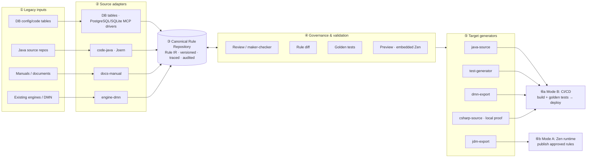

# Business Rules Platform — Architecture Design

> **Status:** Phase-3 generic/local implementation baseline, v1.3 (2026-07-12). Companion to `prd.md` (product requirements — read it first for domain/scope). This document is the source of truth for architecture detail. It reviews and supersedes `prd-architecture-revision-note.md`. Phases 1–3 are implemented and regression-tested against synthetic/local fixtures; customer-specific compatibility, accuracy, toolchain, and rollout evidence remains explicitly gated in §14.

## 0. Relationship To The Knowledge Assistant

The Telecom Business Knowledge Assistant PRD (`../agent_testcase/services/knowledge-api/prd.md`, especially §4.10) provides product context for why this track exists, but it is not this application's executable specification. It confirms that PGM source generation is a larger, deferred, separately designed capability and that a PGM may map to a screen, batch job, interface, API, or service.

This platform therefore adopts the knowledge product's useful trust principles — evidence provenance, Korean preservation, review before activation, versioned regression sets, and configuration-driven extensibility — without reusing or depending on its chat, RAG ingestion, vector retrieval, Neptune schema, document chunks, or citation API. A manual-document adapter may consume exported source evidence through its own contract; it must not make the knowledge assistant a runtime dependency.

## 1. Design Constraints (customer-confirmed)

| Constraint | Source |
|---|---|
| Production path for logic-in-code sites = **generated source code** (mode B), not a runtime engine | Customer, 2026-06-30 |
| For sites already on a third-party engine, end state = **our engine as the production runtime** (mode A) | Customer, 2026-07-03 |
| **Java-first**, extensible to other languages; **PostgreSQL-first**, extensible to other DBMS | Customer, 2026-07-02 |
| **Multi-site, general-purpose product** — config-driven, plug-and-play; DB access as a reusable MCP library | Customer, 2026-07-02 |
| Source-code rule mining is the **strategic differentiator** vs other engines | Customer, 2026-06-30 |
| Engine: **GoRules Zen** effectively accepted (license/cost concerns resolved); formal confirmation pending | Customer, 2026-07-02/03 |
| DMN import for legacy engine assets is in scope; finance/insurance governance (maker-checker, audit) required | Customer, 2026-07-02; PRD §8 |

## 2. Architecture Decision Records

### ADR-1 — The Canonical Rule IR is the system of record

**Decision.** The platform owns a lightweight, vendor-neutral **Canonical Rule IR** (§5). It is the *only* primary storage format. JDM, DMN, DRL, Java source, and every other engine/language format are **adapters**: imported *into* the IR, or generated *from* it. Never store an engine-native format as truth.

**Rationale.** (i) The product must ingest many input kinds (DB tables, stored objects, Java/UI code metadata, manuals, DMN/DRL assets) and emit many targets (Java, C#, JDM, DMN) — only a neutral hub format keeps that M×N problem at M+N adapters. (ii) JDM is one vendor's format; making it the internal model silently shapes the whole product around one engine even though half the delivery story is generated source. (iii) Full DMN/DRL/ODM semantics are too broad to generate safe code from, and lack the metadata we need (source traceability, confidence, approval status, generator/deploy metadata). (iv) Codegen needs a *restricted, deterministic* rule profile — that restriction is easiest to enforce in a format we own.

**Consequences.** IR schema versioning/migration becomes our responsibility (§5.5). Every new engine or language is an adapter, not a core change. Governance, diffing, and testing all operate on one format.

### ADR-2 — A and B are per-site delivery modes over one IR, not an architecture fork

**Decision.** "Externalization" (A: system calls our engine at runtime) and "code generation" (B: generated source is the runtime) are both **target paths from the same approved IR**, chosen per site:

- **Mode B** — sites whose logic was buried in source code (PRD §5.1 macro-case a). Phase-1 lead; the differentiator.
- **Mode A** — sites migrating off an existing third-party engine (PRD §5.1 #6). Confirmed end state (2026-07-03): converting an engine-based site to hard-coded source would forfeit the rules-as-data benefit it already has.

**Consequences.** The engine is **not optional** product-wide — it is the production runtime for mode-A sites. But it is also never load-bearing for mode-B production. Adding mode A costs one export adapter (IR→JDM) plus runtime packaging, because everything upstream (adapters, repository, governance) is shared.

### ADR-3 — Embedded GoRules Zen for preview and mode-A runtime; no bespoke rule evaluator

**Decision.** Do **not** build an internal Rule-IR evaluator in the MVP. Preview/simulation everywhere, and mode-A production, use **GoRules Zen embedded in-process**, fed by the IR→JDM export adapter.

**Rationale.** The customer has effectively accepted Zen; mode A requires it anyway; it is MIT-licensed, embeddable, and polyglot. A bespoke evaluator would add a **third execution semantics** (evaluator vs Zen vs generated Java) — three implementations of "what does this rule mean" that can silently disagree. Two is already one too many; we manage that with the authority rule below.

**Consequences.** Preview semantics = JDM/Zen semantics. Therefore, for mode B, preview is *advisory only*: the **authoritative golden tests compile and execute the generated source itself** (§7). If a future constraint forbids Zen, the IR v1 profile is small enough that writing an evaluator then is a contained task.

### ADR-4 — Production code generation is deterministic; LLMs are confined to mining

**Decision.** Target generators are **AST/template-based and deterministic**: the same recorded ADR-8 `ReleaseInput` produces byte-identical output. Decision-source generation depends on approved IR content; generated golden tests and the release manifest additionally depend on the governed suite, lookup snapshots, target config, and generator version recorded in `ReleaseInput`. LLMs participate only in **extraction** (turning legacy logic into *candidate* rules that humans review); no LLM-generated text ever flows into production artifacts.

**Rationale.** Finance/insurance compliance requires reviewable, reproducible, auditable output. Recording every behavior-affecting input avoids the false claim that mutable golden cases or lookup data are implied by IR alone. Determinism also makes generated-code diffs meaningful in PR review (§7.3).

### ADR-5 — Polyglot split: Python platform core, Java-native generation toolchain

**Decision.** Platform services (adapter orchestration, rule-repository API, governance backend, decision service) are **Python/FastAPI**. Artifact-facing Java work — the source generator, seam cut-over recipes, golden-test rendering — is a small **Java toolchain** (JavaPoet + OpenRewrite + google-java-format) packaged as a versioned CLI the platform invokes (JSON IR in → files out).

**Rationale.** (i) Team competency: this workspace already runs a FastAPI backend and a Vue frontend — same stack, faster delivery, one hiring profile. (ii) GoRules Zen ships an official **Python** binding (also Rust/Node/Go) but **no official Java binding** — embedding Zen for preview is natural from Python. (iii) LLM/mining tooling is Python-native. (iv) But *generating and refactoring Java* is safest with Java-native AST tools — hand-rolled Java emission from another language is where codegen bugs breed.

**Consequences.** Two build systems (uv + Gradle), kept decoupled by the CLI contract. Because Zen has no official Java binding, mode-A delivery for Java legacy sites runs as a thin **sidecar decision service** (FastAPI + embedded Zen) rather than in-process — acceptable, and consistent with how their previous third-party engines were typically deployed.

### ADR-6 — Repository lifecycle is a governed envelope around immutable IR content

**Decision.** The canonical decision content does not contain repository revision or lifecycle status. PostgreSQL stores an immutable content snapshot plus a governed revision envelope:

```text
DecisionRevision:
  decision_key, revision, content, content_hash
  lifecycle_status, effective_from, effective_to
  created_by, submitted_by, approved_by, rejected_by
  created_at, submitted_at, decided_at
```

Content, revision identity, and effective interval are never updated. Submit/approve/reject/retire operations append lifecycle events and update only a transactional current-state projection on the revision envelope; generated content is always loaded through an envelope whose projected status is `APPROVED`. The event log is authoritative for lifecycle history. The API never accepts client-supplied revision or lifecycle fields inside IR content.

**Rationale.** Embedding `status` and `version` inside JSON while also storing them in relational columns creates two competing truths. Separating the governed envelope from vendor-neutral decision content preserves deterministic generation while keeping workflow queries and constraints explicit.

**Effective dating.** Approval rejects overlapping approved effective intervals for the same decision key and release channel. Generation requires either an explicit revision or an `as_of` timestamp; an implicit request resolves the one approved revision effective at that timestamp, never merely the greatest revision number.

### ADR-7 — IR v1 has fully specified, cross-target execution semantics

**Decision.** IR v1 uses typed operands and assignments, not language expressions. Operators are `EQ`, `NE`, `GT`, `GTE`, `LT`, `LTE`, `IN`, `NOT_IN`, `BETWEEN`, `EXISTS`, and `STARTS_WITH`. Scalar types are `boolean`, `integer`, `decimal`, `string`, and `date`; list values are homogeneous lists of those scalar types. Java decimal generation uses `BigDecimal`, and dates use `LocalDate`.

An operand is one of:

- `INPUT(name)` — a declared, Java-safe logical input name; optional `sourcePath` records the legacy dotted/property path.
- `LITERAL(value)` — a typed JSON literal.
- `LOOKUP_FIELD(lookup, keys, field)` — a declared lookup, input/literal key bindings, and one selected field.

`EXISTS` is unary. `IN`/`NOT_IN` require a non-empty homogeneous list. `BETWEEN` requires exactly two ordered values. `STARTS_WITH` accepts strings only. Validation rejects any operator/type combination not defined by the profile.

Actions remain deterministic `SET(output, literal)` assignments. Legacy increments and collection mutations are represented as independent `COLLECT` decisions rather than side effects. `FIRST` and `UNIQUE` return one typed output record and require `defaultOutput` for no-match behavior; `UNIQUE` fails if more than one rule matches. `COLLECT` returns an ordered list of typed output records and returns an empty list when nothing matches. A site composition specification may deterministically combine decision outputs using only the v1 aggregators `SUM`, `DISTINCT`, and `FIRST_NON_NULL`; the generated façade implements that composition.

**Authority.** The Pydantic validator, JDM exporter, Zen preview, Java generator, and consistency suite must implement these semantics from one checked-in conformance corpus. A profile extension is not accepted until all active targets pass the same corpus.

### ADR-8 — Delivery inputs and validation evidence are versioned

**Decision.** A generated release is identified by all behavior-affecting inputs, not IR alone:

```text
ReleaseInput = decision content hash
             + decision revision/effective interval
             + approved golden-suite revision/hash
             + lookup snapshot ids/hashes used by tests
             + site target/composition config hash
             + generator version
```

Golden suites are immutable, versioned records with case provenance. Lookup data used by tests is exported to immutable snapshots; production lookup providers may remain live, but the release gate always records the tested snapshot. The artifact manifest contains every input hash and every output hash.

**Delivery ordering.** The one-time integration seam is landed and verified on the target repository's baseline before recurring delivery begins. Each delivery branches from that seam-enabled baseline, generates code and tests, compiles and runs generated Java, runs target-application regression tests through the façade, emits a semantic diff, and only then commits/pushes or opens a review request. The Phase-1 fixture uses a local bare remote and PR-equivalent review report so the complete branch flow is testable without external credentials.

## 3. System Overview



Six stages; the repository (③) is the hub. Users editing/adding rules in operation (SM phase) write to ③ through ④ — the same governance gate as extracted candidates.

## 4. Component Responsibilities

| # | Component | Responsibility | Explicitly NOT its job |
|---|---|---|---|
| ② | Source adapters | Extract *candidate* IR rules from one input kind, attach `sourceReferences` + `confidence` | Approving rules; writing production artifacts |
| ③ | Rule repository | Store IR; version every change; keep full audit trail | Storing JDM/DMN/source (generated artifacts live in git/artifact store) |
| ④ | Governance & validation | Review workflow, approval gates, diff, golden-test execution, preview | Mutating rules silently; auto-approving anything |
| ⑤ | Target generators | Deterministically render content from an approved revision envelope into one artifact kind | Deciding *which* rules are live (release selection is a repository/delivery responsibility) |
| ⑥ | Delivery | Mode B: git branch/PR + CI/CD; Mode A: publish to Zen runtime | Bypassing golden tests |

## 5. Canonical Rule IR v1

### 5.1 Profile and invariants

The v1 profile admits only structures that every active executor can review and implement identically:

- decision-table condition/action rules;
- the typed operators and operands defined by ADR-7;
- `all`/`any` condition groups, with maximum nesting depth 3;
- hit policies `FIRST`, `UNIQUE`, and `COLLECT`;
- declared lookup references with explicit key bindings and selected fields;
- deterministic output assignment and the three site-composition aggregators in ADR-7;
- no inline SQL, arbitrary calls, side effects, full FEEL, or language snippets.

Anything an adapter cannot express becomes a review-queue item containing the raw fragment, exact provenance, reason code, and adapter version. It is never silently dropped or coerced. A profile extension requires schema migration plus conformance tests for Pydantic, JDM/Zen, and every active target generator.

### 5.2 Decision content shape

Repository status, revision, actors, and effective dates are deliberately absent from this content object; ADR-6 places them in the governed revision envelope.

```json
{
  "decisionId": "enrollment_eligibility",
  "decisionName": "가입 자격 판정",
  "profile": "RULE_IR_V1",
  "schemaVersion": 1,
  "product": "CANCER_BASIC",
  "programContexts": [
    { "programId": "ENROLLMENT-API", "kind": "API",
      "entryPoint": "legacy.EnrollmentValidator#evaluate" }
  ],
  "hitPolicy": "FIRST",
  "inputs": [
    { "name": "age", "sourcePath": "customer.age", "type": "integer", "required": true },
    { "name": "regionCode", "sourcePath": "customer.regionCode", "type": "string", "required": true }
  ],
  "outputs": [
    { "name": "eligible", "type": "boolean" },
    { "name": "reasonCode", "type": "string" }
  ],
  "defaultOutput": { "eligible": true, "reasonCode": "ELIGIBLE" },
  "lookups": [
    { "name": "region_eligibility", "ref": "lookup://region_eligibility" }
  ],
  "rules": [
    {
      "ruleId": "R001",
      "when": {
        "all": [
          { "left": { "kind": "INPUT", "name": "age" },
            "operator": "LT",
            "right": { "kind": "LITERAL", "value": 18 } }
        ]
      },
      "then": [
        { "output": "eligible", "value": false },
        { "output": "reasonCode", "value": "UNDER_AGE" }
      ],
      "origin": "EXTRACTED",
      "sourceReferences": [
        { "type": "JAVA_SOURCE", "repository": "legacy-enrollment", "revision": "abc123",
          "file": "src/main/java/legacy/EnrollmentValidator.java",
          "lineStart": 24, "lineEnd": 29 }
      ],
      "confidence": 0.82
    }
  ]
}
```

Logical names such as `age` must be valid identifiers in every active target language. `sourcePath` preserves the legacy property path without leaking language syntax into execution semantics.

### 5.3 Provenance and authored rules

Every rule has an `origin`:

- `EXTRACTED` requires one or more source references and `confidence` in `[0,1]`.
- `USER_AUTHORED` requires a `USER_ACTION` reference containing actor, timestamp, and reason; confidence is omitted because it is not an extraction score.

Source references are discriminated records, not a generic file/line structure:

- `JAVA_SOURCE`: repository, immutable revision, file, line range, optional symbol.
- `DB_ROW`: connection alias, schema, table, primary-key JSON, snapshot id/hash.
- `MANUAL_DOC`: document id/revision and page, slide, sheet, section, or cell range.
- `DMN_ASSET`: repository/object id, immutable revision, decision id, and element id.
- `USER_ACTION`: actor, timestamp, and reason.

This follows the knowledge product's trust model: an evidence pointer identifies the exact source revision and location, not merely a filename. Korean text is preserved byte-exact through source evidence, content JSON, database storage, previews, generated strings, and reports.

### 5.4 Revision lifecycle and maker-checker

Revision-envelope states are:

```text
DRAFT → SUBMITTED → APPROVED | REJECTED
APPROVED → RETIRED
```

The revision creator is the maker. Submit is allowed only by the maker or a configured delegate. Approve/reject requires an authenticated actor different from both creator and submitter; Phase 1 uses a development actor header, but the service rule is the same. Every transition appends an audit event with actor, timestamp, previous/new state, reason, content hash, and request correlation id.

An approved revision is immutable. Editing it creates a new `DRAFT` revision. Approval also validates effective-date overlap and requires an approved golden-suite revision.

### 5.5 Schema evolution and conformance

`profile` plus `schemaVersion` gate every reader and writer. Migrations are forward-only scripts checked into this repository. Adapters and generators declare supported profile/version ranges. `tests/conformance/` contains canonical inputs and expected results shared by the Pydantic model, JDM/Zen evaluator, Java generator, and consistency runner.

## 6. Source Adapters

### 6.1 Contract

```text
SourceAdapter:
  discover(siteConfig)              -> Source[]           # what's there to extract
  extract(source)                   -> ExtractionBatch    # decision content + unmappable items
  # every CandidateRule carries sourceReferences + confidence; nothing is auto-approved
```

Adapters are capability-declared packages (`db-postgres`, restricted `db-postgres-stored-object`, `code-java`, `engine-dmn`, restricted `engine-native`, `ui-html-validation`, and `docs-manual`; future production drivers/languages remain plug-ins). Site onboarding = a secret-free site profile plus a preflight capability matrix. Unknown, incompatible, or locally unavailable source/target/runtime capabilities stop orchestration before extraction or generation. Nothing site-specific may live inside an adapter.

### 6.2 `db-postgres` — config/code tables (priority-1 source)

Deterministic ETL: map condition columns / action columns per a reviewed mapping spec; each row → one IR rule, `confidence = 1.0` (still reviewed, but near-lossless). A `DB_ROW` reference records schema/table, primary-key JSON, and a snapshot hash — row ids are never overloaded into source line fields. DB access goes through the **reusable DB MCP library** — connection-info-driven, plug-and-play per the multi-site directive; the adapter never embeds site credentials or schema assumptions.

The connector authenticates with a database role that has `SELECT`/metadata permissions only. Transaction read-only mode is defense in depth, not the primary control. Dynamic identifiers are resolved from catalog-discovered allowlists and quoted by the driver; tests attempt writes and identifier injection and must prove both are rejected.

### 6.3 `code-java` — source mining (the differentiator)

Pipeline (detail rationale in PRD §5.1 #3):

```text
git repo → Joern parse (Code Property Graph: AST + CFG + data-dependency)
        → seed program entry points (SCREEN/BATCH/INTERFACE/API/SERVICE)
        → call-graph reachability (drop everything unreachable — solves repo scale)
        → keep units containing decision constructs (if/switch/validation/lookup)
        → backward slice per decision point (self-contained chunk + exact file/line)
        → LLM mining: chunk → candidate IR rules (conditions/actions + sourceReferences + confidence)
        → de-dup → PENDING_REVIEW
```

The code graph is **throwaway scaffolding** (rebuilt per analysis run, in Joern's own store) — the durable outputs are candidate decision content, unmappable items, program-context mappings, and a slice manifest. Each source repository is pinned to an immutable commit for a mining run. Chunking criteria: real syntax boundaries (method), relevance gate (reachable ∧ decision-bearing), self-contained slices, split oversized units per decision point.

### 6.4 `engine-dmn` — external-engine import

`DMN 1.3+ asset → parse decision tables → Canonical Rule IR candidate`. The implemented subset maps input columns to conditions, output columns to actions, and `FIRST`/`UNIQUE`/`COLLECT` hit policies to IR. Literal equality, comparisons, inclusive ranges, lists, and `not(...)` map to typed IR operators. Every imported rule retains asset id, immutable revision, decision id, and exact rule-element id; Korean text remains UTF-8. Unsupported FEEL and non-table boxed expressions become review items rather than guessed rules. DTD/entity declarations are forbidden, and **BPMN is rejected** because workflow orchestration is not a rule table. DRDs and full FEEL remain outside the profile. Phase 3 adds a separate restricted DRL adapter; ODM artifacts are classified and routed to customer-mapping review rather than guessed.

### 6.6 Stored-object and UI validation sources (Phase 3)

The stored-object adapter consumes source only through the bounded connector allowlist. It recognizes a deliberately small PL/pgSQL function form: typed scalar parameters, ordered `IF`/`ELSIF` comparisons, literal `RETURN` values, and one literal `ELSE` default. Any assignment, call, loop, SQL statement, compound condition, or unsupported type invalidates the whole object and creates a review item. Candidates carry connection alias, schema/object, content hash, and exact line provenance.

The UI adapter uses a non-executing HTML parser. Numeric `min`/`max` plus explicit `data-rule-eq`/`data-rule-in` metadata can become candidate validations. Native `required`/`pattern`, event handlers, scripts, and framework expressions are review items; JavaScript is never evaluated. This is static declarative metadata coverage, not arbitrary UI-code mining.

### 6.7 Engine-native boundary (Phase 3)

The restricted DRL importer accepts one fact pattern containing literal field comparisons and consequences containing only literal `result.setX(...)` assignments. It requires one unconditional default, preserves rule/asset/hash/line provenance, and routes unsupported attributes, conditions, or consequences to review. ODM has no safe generic interchange shape without customer product/version artifacts, so it is identified and stopped at `ODM_FORMAT_REQUIRES_CUSTOMER_MAPPING`. BPMN remains rejected.

### 6.5 `docs-manual` — manuals (supplementary)

Rule-oriented extraction to IR shape. May borrow low-level document-parsing utilities from the knowledge-assistant codebase, but not its RAG ingestion/output (different contract — see PRD §2). Used to *corroborate or fill gaps* in mined rules; low confidence by default.

## 7. Target Generators

### 7.1 Contract

```text
TargetGenerator:
  supports(profile, targetConfig)   -> bool
  generate(releaseInput)            -> GeneratedArtifact   # deterministic (ADR-4/8)
```

Implemented target packages are `java-source`, `jdm-export`, `test-generator`, restricted `dmn-export`, and `csharp-source`. Report generation remains later/customer-driven.

### 7.2 `java-source`

- Renders each independently evaluated decision to a self-contained Java class using JavaPoet and the ADR-7 type mapping.
- `FIRST`/`UNIQUE` classes return one output record and use the required `defaultOutput` on no match. `COLLECT` classes return `List<Output>` in rule order. `UNIQUE` throws a typed multiple-match exception.
- Lookup operands call a generated `LookupProvider` contract with declared key bindings; lookup results are type-checked before operator evaluation.
- A generated or hand-reviewed site façade composes multiple decisions using only configured `SUM`, `DISTINCT`, and `FIRST_NON_NULL` aggregators. Site composition lives in target config, not in core generator branches.
- Generated code is **owned by the generator**: it lives in a marked package (e.g. `…rules.generated`), carries `@Generated` plus decision/revision/content-hash headers from the release manifest, and is **never hand-edited** — regeneration is the only write path.
- Lookup access goes through a thin provided interface (site supplies the implementation), so generated code stays free of DB/framework coupling.

### 7.3 Delivery flow (mode B)

```text
one-time: land and verify façade seam on target baseline
recurring: approve revision + golden suite → generate from recorded ReleaseInput
        → compile + generated-Java golden tests + target regression tests
        → diff vs previous generated source → commit/push → PR/MR
        → site CI repeats authoritative gates → merge → site CI/CD deploy
```

### 7.4 `jdm-export` (mode A + preview)

IR→JDM is intentionally trivial because the IR v1 profile is a strict subset of what JDM expresses. The same export feeds (a) the embedded-Zen preview in governance and (b) the mode-A production runtime.

Mode-A activation is an append-only publication operation, not a mutable "active" flag. A publish request is serialized per decision and succeeds only when the decision revision is `APPROVED` and effective, the selected golden-suite revision is `APPROVED`, and every case passes Zen with `authority = AUTHORITATIVE`. The publication records the decision/suite hashes, exact JDM document/hash, lookup-snapshot hashes, validation result, actor, channel, and previous publication. Active resolution selects the newest publication for the decision/channel. Rollback reruns the target's immutable golden evidence and appends a new publication referencing both the current and previously validated publication; history is never rewritten.

### 7.5 `test-generator`

Golden suites are governed inputs rather than incidental database rows. Each immutable suite revision contains curated input/expected-output pairs, case provenance, decision-key coverage, and lookup-snapshot references. Suites are seeded from legacy behavior during initial load and extended through maker-checker review. The same suite renders as JUnit against generated Java (mode B) and as Zen evaluation fixtures (mode A), but only the executor named by §9 is authoritative.

### 7.6 Phase-3 DMN and C# targets

`dmn-export` deterministically emits DMN 1.3 decision tables only where a flat IR condition group maps to one unary-test cell per input. It covers equality/inequality, ordering, ranges, and lists; lookup operands, `EXISTS`, `STARTS_WITH`, nested `any`, and multiple conditions for one cell fail explicitly. Provenance is written as deterministic extension metadata, repository lifecycle fields are excluded, and export→import semantic projections are byte-equal.

`csharp-source` deterministically emits typed records, all IR-v1 operators/hit policies, a lookup-provider contract, xUnit golden source, and an ADR-8 manifest. It is a **source-generation plug-in proof** on the current host: because no .NET SDK is installed, compile evidence is `COMPILE_NOT_RUN`. C# cannot become an authoritative Mode-B delivery target until a pinned SDK and target repository compile/run its generated golden suite.

## 8. The Mode-B Integration Seam (initial-load cut-over)

Generating a rule module is not enough — legacy code must *call* it, or edited rules regenerate a module nothing executes. Per site, once:

1. Mining identifies the sliced region(s) in legacy source (§6.3 gives exact file/line).
2. Engineers replace each region with a call to the generated module behind a thin façade (`EnrollmentRuleModule.evaluate(input) -> decision`) — a **one-time, human-reviewed surgical change** (this is SI-phase work, consistent with the customer's framing).
3. The seam branch runs shadow/regression tests and is merged into the delivery baseline before the first recurring rule delivery.
4. From then on, the façade is the stable boundary: regeneration changes what's *behind* it, never the call sites.

Verification of the cut-over: golden tests seeded from pre-cut-over behavior plus target-application regression tests through the façade (shadow comparison where feasible — run old path and new module side by side on sampled inputs; the customer indicated a product-management rule DB can serve as corroborating evidence). The end-to-end demo executes the target application from the delivered branch; a Zen preview result is not accepted as proof of Mode-B delivery.

## 9. Execution & Validation Authority

| | Preview (governance UI) | Authoritative validation | Production |
|---|---|---|---|
| **Mode B** | IR→JDM→embedded Zen (advisory) | Golden tests compiled & run against **generated Java** | Generated source in site's app |
| **Mode A** | Same Zen path (= production semantics) | Golden tests run on **Zen runtime** | Zen engine service |

The asymmetry is deliberate (ADR-3): in mode B there are two executors (Zen preview, generated Java), so exactly one — the one that ships — is the authority. Any preview-vs-authority divergence found by golden tests is a generator bug to fix, tracked as such.

## 10. Multi-Site Packaging

- **Site profile** (config, not code): source connection aliases, source repositories pinned per run, PGM contexts (`SCREEN/BATCH/INTERFACE/API/SERVICE`), language/DBMS, delivery mode, adapter selection, lookup-provider binding, and a target-delivery block containing repository URL/path, base branch, generated/test paths, Java package, composition spec, build/test commands, and PR provider.
- **Reusable DB MCP library**: one bounded connector contract over database drivers. PostgreSQL remains the production reference; SQLite is the dependency-free second-driver proof. Both use catalog-derived identifier allowlists, bounded reads, read-only sessions, redacted failures, and explicit stored-object capability reporting. A production second DBMS still requires customer selection and integration evidence.
- **Adapter registry**: source adapters and target generators register by capability; a site activates them by name in its profile.
- **Capability preflight**: a deterministic matrix evaluates every selected source, generator, and runtime against site language, DBMS, delivery mode, and available Java/.NET/Joern/Zen/database tooling. Reports contain no connection values or repository paths; any `UNKNOWN`, `INCOMPATIBLE`, or `UNAVAILABLE` result makes the site not ready.
- **Local orchestration workbench**: FastAPI exposes catalog, inline extraction, deterministic target preview, and preflight endpoints to the Vue UI. Inputs are size/basename bounded and parsed in memory or an isolated temporary directory. Results are always non-persistent/non-authoritative; moving a candidate into the repository or producing a release remains a separate governed operation.
- **Hard rule:** anything that cannot be made general (a site-specific hack) must be isolated in the site profile/plug-in layer and flagged — never merged into core (PRD §8).
- Deployment: self-hostable, on-prem/air-gap friendly (finance/insurance); AWS acceptable. Mode-A runtime ships as an embedded library or small service alongside the site's stack.

## 11. Risks & Mitigations

| Risk | Mitigation |
|---|---|
| Mining precision (wrong/missed rules) | Candidate-only + mandatory review; confidence + exact source refs; golden tests seeded from legacy behavior; shadow comparison at cut-over (§8) |
| Preview vs production semantic drift (mode B) | Authority rule (§9); divergences = generator bugs; deterministic generation makes them reproducible |
| FEEL / complex DMN beyond IR profile | Restricted profile + review queue with raw fragment attached; profile grows only when all generators support it (§5.1) |
| Integration seam underestimated | Named Phase-0/1 deliverable (§8); designed against real sample code, not in the abstract |
| IR schema drift across sites/versions | Profile+schema versioning, forward-only migrations, adapter capability declaration (§5.5) |
| Engine decision reversal | Engine sits behind IR + `jdm-export`; swap = new export adapter + runtime packaging, upstream untouched (ADR-1/2) |
| Repository row status diverges from content JSON | Lifecycle/revision metadata lives only in the ADR-6 envelope; content hashes are immutable |
| Same rule produces different release evidence | ADR-8 manifest hashes golden-suite, lookup snapshot, site config, generator, content, and outputs |
| Delivery branch is not the code actually executed | Seam is merged into the baseline first; target regression tests run from the generated delivery branch |

## 12. Phase Mapping (deliverables)

| Phase | Deliverables |
|---|---|
| **0 — Design & samples** | ADR-6..8 semantics + IR conformance corpus; adapter/generator contracts; PGM-context and target-delivery config; integration-seam design against synthetic/sample Java; confirm pilot's engine assets; **mining-model benchmark** when real samples arrive |
| **1 — PoC (mode B)** | `db-postgres` (via MCP lib) + `code-java` (Joern) adapters; a bounded supplementary `docs-manual` adapter; IR repository + review workflow; versioned golden suites; embedded-Zen preview; `java-source` + `test-generator`; seam-enabled baseline; diff/PR-ready branch + CI golden/target tests; demo per PRD §11 |
| **2 — Productize + mode A** | **Implemented generically/local:** restricted `engine-dmn`; append-only Mode-A IR→JDM→Zen publication/rollback; PostgreSQL/SQLite driver contract; versioned mining benchmark with synthetic-only proof; OIDC/JWT roles, configurable evidence, atomic batch review, and deployer authorization. Real customer benchmark, production IdP, pilot roles, and production second DBMS remain gated. |
| **3 — Scale** | **Implemented generically/local:** restricted scalar PL/pgSQL mining; non-executing declarative HTML validation mining; restricted DRL import plus ODM review boundary; deterministic DMN export/round trip; C# source/golden/manifest plug-in with fail-closed compile evidence; deterministic multi-site capability preflight. Real dialect/framework/ODM/C# compatibility and rollout remain gated. |

## 13. Technology Stack And Libraries

Concrete choices per component (rationale in ADR-5; all self-hostable / air-gap-mirrorable per PRD §8). **Primary** = what we build first; alternatives noted where a real fallback exists.

### 13.1 Platform core

| Component | Primary choice | Notes / alternatives |
|---|---|---|
| Platform API & orchestration | **Python 3.12 + FastAPI + Pydantic v2** | IR schema = Pydantic models (JSON Schema exported from them — one definition, validated everywhere). Matches existing team stack. |
| Rule repository storage | **PostgreSQL 16** — immutable content as `JSONB`, revision envelopes, lifecycle events, versioned golden suites, and audit tables; SQLAlchemy + Alembic | PostgreSQL is the Phase-1 system of record. Git stores generated artifacts and review diffs, not canonical decision content. |
| Governance UI | **Vue 3 + TypeScript + Vite + Pinia** | Team consistency with the existing `frontend/` app (React would work; no reason to split stacks). **ag-grid-community** (MIT) for editable decision tables; **monaco-editor** for JSON/rule-diff views. |
| AuthN/Z | **OIDC/JWT via PyJWT + JWKS** (Keycloak as self-host reference) | Fixed asymmetric algorithm allowlist; required issuer, audience, subject, issued-at, and expiry claims; `maker`/`checker`/`reviewer`/`deployer` enforced in the API. Local `X-BRP-*` identity headers work only when `BRP_LOCAL_DEVELOPMENT_HEADERS=true`; production rejects them. Maker-checker remains an app invariant independent of IdP roles. |
| Packaging | **Docker Compose** (api, ui, postgres, joern, decision-service); `uv` for Python, `pnpm` for UI | Compose-first for on-prem/air-gap; k8s optional, never required. |
| Observability | structlog (JSON logs); OpenTelemetry optional per site | Keep light. |

### 13.2 Source adapters (extraction)

| Adapter | Primary choice | Notes / alternatives |
|---|---|---|
| `code-java` mining | **Joern** (`javasrc2cpg` frontend; CPGQL in server mode, driven from Python) | The CPG store is Joern's own — **no Neo4j/Neptune needed**; the graph is throwaway scaffolding (§6.3). tree-sitter as a cheap pre-scan fallback. |
| LLM rule mining | **Tiered + benchmark-selected, provider-swappable** — bulk extraction on a value-tier model; hard slices & verification on a frontier-tier model | Mining is token-heavy, repetitive, structured-output work with a downstream safety net (human review + golden tests). Phase 1 uses recorded mock responses; a real-provider default is selected only by the gated benchmark on customer-approved slices. Structured output is validated by the same Pydantic IR models regardless of provider. LLM output is candidate-only (ADR-4). |
| LLM deployment per site | API where policy allows; **self-hosted open-weights (vLLM)** for air-gapped sites | Open-weights options (DeepSeek/Qwen/GLM/Kimi) are the only viable path for air-gapped finance sites — no closed API (Claude included) can serve them. Conversely, some sites may restrict specific foreign endpoints; the site profile (§10) selects the provider, the pipeline code never changes. |
| DB MCP library | **Official Python MCP SDK (FastMCP)** + driver protocol; **psycopg 3** for PostgreSQL and stdlib **sqlite3** for the local portability proof | No arbitrary SQL MCP tool. SQLite opens file URIs with `mode=ro` and `PRAGMA query_only`; its lack of stored-procedure source is reported as an unsupported capability. Oracle/MSSQL remain candidate production drivers after customer selection. |
| `engine-dmn` | Hardened stdlib **ElementTree** parsing plus a hand-rolled restricted FEEL parser | DTD/entities are rejected before parse. Complex FEEL/boxed expressions → review queue (§6.4); BPMN is rejected. Full XSD/DRD support is intentionally outside the implemented subset. |
| Stored-object/UI/engine-native | Regex-bounded PL/pgSQL subset; stdlib `HTMLParser`; restricted DRL parser | These parse declarative subsets only. No SQL/UI code executes. ODM is review-only until customer artifacts define the versioned mapping. |
| `docs-manual` | pdfplumber / python-docx / openpyxl + LLM extraction | Supplementary source; low default confidence. |

### 13.3 Target generators & delivery

| Component | Primary choice | Notes / alternatives |
|---|---|---|
| `java-source` generator | **Java 17 toolchain: JavaPoet** (AST-safe class generation) + **google-java-format** (deterministic formatting) — packaged as a Gradle-built CLI: release manifest + JSON IR in → `.java` out | JavaPoet is the Phase-1 choice. Site-specific style differences are formatter/import/package configuration, not alternate free-form templates. |
| Integration-seam cut-over (§8) | **OpenRewrite** recipes — replace the mined region with the façade call | Semi-automated, always lands as a human-reviewed PR. This is *refactoring existing code*; distinct from generation (JavaPoet) and mining (Joern). |
| `test-generator` | JUnit 5 sources via the same Java toolchain; JSON fixtures for Zen (mode A) | Golden-test authority per §9. |
| `jdm-export` | Pure Python JSON transform, round-trip-validated against embedded Zen | Trivial by design — IR v1 ⊂ JDM. |
| `dmn-export` | Deterministic stdlib XML generation | Restricted unary-test subset with provenance extensions and import semantic round-trip tests. |
| `csharp-source` | Deterministic Python renderer + xUnit source + ADR-8 manifest | All IR-v1 operators/hit policies and lookup contract are rendered. Current evidence is `COMPILE_NOT_RUN`; pin/install .NET before executable claims. |
| Preview + mode-A runtime | **GoRules Zen** via the `zen-engine` Python binding, embedded in a thin stateless FastAPI **decision service** | Same service serves governance preview and mode-A production (scaled/hardened). No official Java Zen binding → Java sites integrate mode A via this sidecar, not in-process (ADR-5). |
| CI/CD delivery (mode B) | git branch/PR flow (GitHub/GitLab — per site), **Gradle** builds the generated module | Platform side uses `gh`/API; the site's existing pipeline stays the deploy authority. |

### 13.4 Explicitly not in the stack

- **No graph database** (Neo4j/Neptune) — Joern's internal CPG store covers mining; the graph is rebuilt per run.
- **No message broker** (Kafka etc.) — extraction is batch; FastAPI + task queue in-process is enough at this scale.
- **No rule-engine BRMS suite** (GoRules BRMS paid tier, Camunda platform) — governance UI is ours; only the MIT Zen evaluator is consumed.

## 14. Implemented Decisions And Remaining Customer Inputs

### 14.1 Closed for implementation

1. **Packaging:** one IR decision per independently evaluated decision table. Product/flow behavior is composed by the site façade using the restricted ADR-7 aggregators.
2. **Lookups:** IR declares typed key/result bindings; production uses a site `LookupProvider`; golden gates use immutable lookup snapshots and record their hashes.
3. **Repository:** PostgreSQL is the canonical Phase-1 store; Git is the delivery/review store for generated artifacts.
4. **Java generation:** JavaPoet + google-java-format is binding for Phase 1.
5. **Engine:** Zen is the advisory preview executor and the future Mode-A executor behind `jdm-export`; generated Java remains Mode-B authority.
6. **Development isolation:** local/CI containers are the default for automated tests. Shared EC2/RDS resources are optional integration targets and require explicit human authorization before mutation or service-impacting changes.
7. **Mode A:** Zen is authoritative only through an immutable publication that records passing golden evidence and artifact hashes; rollback is another publication, never history mutation.
8. **Authentication/authorization:** OIDC issuer/audience/JWKS configuration and fixed asymmetric JWT algorithms are mandatory outside an explicitly enabled local-header mode. API roles and maker-checker identity separation are both enforced.
9. **Portability proof:** SQLite proves the DB driver boundary locally; it is not evidence for an unnamed production DBMS.
10. **Mining benchmark:** benchmark/ground-truth/provider-policy formats and metrics are implemented, but the checked-in result is `SYNTHETIC_NON_CUSTOMER` and cannot support customer mining-accuracy claims.
11. **Phase-3 source boundaries:** PL/pgSQL, HTML validation, and DRL are restricted declarative subsets. Unsupported fragments are review evidence, never silently executed or coerced. ODM remains review-only without customer artifacts.
12. **Phase-3 targets:** DMN export has semantic round-trip proof. C# has deterministic source/golden/manifest proof only; executable authority remains blocked by the absent pinned .NET toolchain.
13. **Scale preflight:** multi-site orchestration is fail-closed through a deterministic, secret-free capability matrix.

### 14.2 Still customer-gated

- Real source/schema samples and the pilot product/flow.
- Site-specific target repository conventions and the human-reviewed seam design.
- The pilot's exact role-to-user/group mapping and release-evidence thresholds.
- Production IdP issuer/audience/JWKS metadata and key-rotation/availability acceptance.
- Customer provider policy, approved source-slice scope, approval metadata, and real ground truth for a real-slice mining benchmark.
- The production second-DBMS target and its customer-owned read-only credentials/catalog acceptance (SQLite is only the local contract proof).
- Immutable real stored-object, UI-framework, DRL, and ODM samples plus expected mappings for compatibility/accuracy evidence.
- A pinned .NET SDK, C# target conventions/repository, and authoritative compile/golden execution evidence.
- Product/flow/site inventory and approval for an actual multi-site rollout; the current matrix uses synthetic profiles.
- Production lookup freshness/SLA and release-channel policy.

These inputs block real-site rollout and benchmark claims, but not the synthetic/local Phase-1 and Phase-2 proofs or the generic contracts above.
