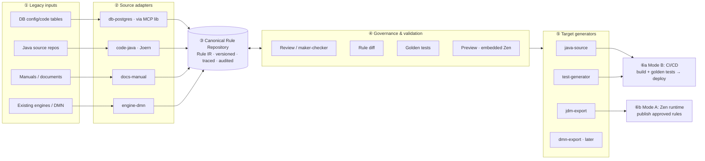

# Business Rules Platform — Architecture Design

> **Status:** working design, v1 (2026-07-03). Companion to `prd.md` (product requirements — read it first for domain/scope). This document is the source of truth for architecture detail. It reviews and supersedes `prd-architecture-revision-note.md`, adopting its core idea (a vendor-neutral canonical IR) with three deliberate deviations, recorded in the ADRs below: per-site delivery modes instead of "engine as optional afterthought" (ADR-2), an embedded engine instead of a bespoke evaluator (ADR-3), and an explicit mode-B integration seam (§8).

## 1. Design Constraints (customer-confirmed)

| Constraint | Source |
|---|---|
| Production path for logic-in-code sites = **generated source code** (mode B), not a runtime engine | Customer, 2026-06-30 |
| For sites already on a third-party engine, end state = **our engine as the production runtime** (mode A) | Customer, 2026-07-03 |
| **Java-first**, extensible to other languages; **PostgreSQL-first**, extensible to other DBMS | Customer, 2026-07-02 |
| **Multi-site, general-purpose product** — config-driven, plug-and-play; DB access as a reusable MCP library | Customer, 2026-07-02 |
| Source-code rule mining is the **strategic differentiator** vs other engines | Customer, 2026-06-30 |
| Engine: **GoRules Zen** effectively accepted (license/cost concerns resolved); formal confirmation pending | Customer, 2026-07-02/03 |
| DMN import for legacy engine assets is in scope; finance/insurance governance (maker-checker, audit) required | Customer, 2026-07-02; PRD §8 |

## 2. Architecture Decision Records

### ADR-1 — The Canonical Rule IR is the system of record

**Decision.** The platform owns a lightweight, vendor-neutral **Canonical Rule IR** (§5). It is the *only* primary storage format. JDM, DMN, DRL, Java source, and every other engine/language format are **adapters**: imported *into* the IR, or generated *from* it. Never store an engine-native format as truth.

**Rationale.** (i) The product must ingest many input kinds (DB tables, Java code, manuals, DMN assets) and emit many targets (Java, JDM, later C#/DMN) — only a neutral hub format keeps that M×N problem at M+N adapters. (ii) JDM is one vendor's format; making it the internal model silently shapes the whole product around one engine even though half the delivery story is generated source. (iii) Full DMN is too broad (FEEL, boxed expressions, DRDs) to generate safe code from, and lacks the metadata we need (source traceability, confidence, approval status, generator/deploy metadata). (iv) Codegen needs a *restricted, deterministic* rule profile — that restriction is easiest to enforce in a format we own.

**Consequences.** IR schema versioning/migration becomes our responsibility (§5.4). Every new engine or language is an adapter, not a core change. Governance, diffing, and testing all operate on one format.

### ADR-2 — A and B are per-site delivery modes over one IR, not an architecture fork

**Decision.** "Externalization" (A: system calls our engine at runtime) and "code generation" (B: generated source is the runtime) are both **target paths from the same approved IR**, chosen per site:

- **Mode B** — sites whose logic was buried in source code (PRD §5.1 macro-case a). Phase-1 lead; the differentiator.
- **Mode A** — sites migrating off an existing third-party engine (PRD §5.1 #6). Confirmed end state (2026-07-03): converting an engine-based site to hard-coded source would forfeit the rules-as-data benefit it already has.

**Consequences.** The engine is **not optional** product-wide — it is the production runtime for mode-A sites. But it is also never load-bearing for mode-B production. Adding mode A costs one export adapter (IR→JDM) plus runtime packaging, because everything upstream (adapters, repository, governance) is shared.

### ADR-3 — Embedded GoRules Zen for preview and mode-A runtime; no bespoke rule evaluator

**Decision.** Do **not** build an internal Rule-IR evaluator in the MVP. Preview/simulation everywhere, and mode-A production, use **GoRules Zen embedded in-process**, fed by the IR→JDM export adapter.

**Rationale.** The customer has effectively accepted Zen; mode A requires it anyway; it is MIT-licensed, embeddable, and polyglot. A bespoke evaluator would add a **third execution semantics** (evaluator vs Zen vs generated Java) — three implementations of "what does this rule mean" that can silently disagree. Two is already one too many; we manage that with the authority rule below.

**Consequences.** Preview semantics = JDM/Zen semantics. Therefore, for mode B, preview is *advisory only*: the **authoritative golden tests compile and execute the generated source itself** (§7). If a future constraint forbids Zen, the IR v1 profile is small enough that writing an evaluator then is a contained task.

### ADR-4 — Production code generation is deterministic; LLMs are confined to mining

**Decision.** Target generators are **template/AST-based and deterministic**: same approved IR → byte-identical output. LLMs participate only in **extraction** (turning legacy logic into *candidate* rules that humans review); no LLM-generated text ever flows into production artifacts.

**Rationale.** Finance/insurance compliance requires reviewable, reproducible, auditable output. Determinism also makes generated-code diffs meaningful in PR review (§7.3).

### ADR-5 — Polyglot split: Python platform core, Java-native generation toolchain

**Decision.** Platform services (adapter orchestration, rule-repository API, governance backend, decision service) are **Python/FastAPI**. Artifact-facing Java work — the source generator, seam cut-over recipes, golden-test rendering — is a small **Java toolchain** (JavaPoet + OpenRewrite + google-java-format) packaged as a versioned CLI the platform invokes (JSON IR in → files out).

**Rationale.** (i) Team competency: this workspace already runs a FastAPI backend and a Vue frontend — same stack, faster delivery, one hiring profile. (ii) GoRules Zen ships an official **Python** binding (also Rust/Node/Go) but **no official Java binding** — embedding Zen for preview is natural from Python. (iii) LLM/mining tooling is Python-native. (iv) But *generating and refactoring Java* is safest with Java-native AST tools — hand-rolled Java emission from another language is where codegen bugs breed.

**Consequences.** Two build systems (uv + Gradle), kept decoupled by the CLI contract. Because Zen has no official Java binding, mode-A delivery for Java legacy sites runs as a thin **sidecar decision service** (FastAPI + embedded Zen) rather than in-process — acceptable, and consistent with how their previous third-party engines were typically deployed.

## 3. System Overview



Six stages; the repository (③) is the hub. Users editing/adding rules in operation (SM phase) write to ③ through ④ — the same governance gate as extracted candidates.

## 4. Component Responsibilities

| # | Component | Responsibility | Explicitly NOT its job |
|---|---|---|---|
| ② | Source adapters | Extract *candidate* IR rules from one input kind, attach `sourceReferences` + `confidence` | Approving rules; writing production artifacts |
| ③ | Rule repository | Store IR; version every change; keep full audit trail | Storing JDM/DMN/source (generated artifacts live in git/artifact store) |
| ④ | Governance & validation | Review workflow, approval gates, diff, golden-test execution, preview | Mutating rules silently; auto-approving anything |
| ⑤ | Target generators | Deterministically render approved IR into one artifact kind | Deciding *which* rules are live (they consume `status = approved` only) |
| ⑥ | Delivery | Mode B: git branch/PR + CI/CD; Mode A: publish to Zen runtime | Bypassing golden tests |

## 5. Canonical Rule IR v1

### 5.1 Profile (restricted by design)

The v1 profile only admits structures we can review, test, and generate code from safely:

- decision tables and condition/action rules;
- operators: `=, !=, >, >=, <, <=, IN, NOT_IN, BETWEEN, EXISTS`;
- `AND`/`OR` condition groups (nesting allowed, bounded depth);
- hit policies: `FIRST`, `UNIQUE`, `COLLECT`;
- explicit lookup-table references (no inline SQL, no arbitrary calls);
- deterministic output assignment only — **no side effects, no arbitrary function execution, no full FEEL**.

Anything a source adapter cannot express in this profile becomes a *review-queue item with the raw fragment attached*, never a silently-dropped or silently-mangled rule. The profile grows deliberately (v1.1, v2 …) — each extension must be supported by **every** active target generator before it is admitted, or generation would break asymmetrically.

### 5.2 Shape

```json
{
  "decisionId": "enrollment_eligibility",
  "decisionName": "가입 자격 판정",
  "profile": "RULE_IR_V1",
  "version": 7,
  "status": "APPROVED",
  "product": "cancer-insurance-basic",
  "effective": { "from": "2026-08-01", "to": null },
  "hitPolicy": "FIRST",
  "inputs":  [ { "name": "customer.age", "type": "number" },
               { "name": "product.code", "type": "string" } ],
  "outputs": [ { "name": "eligible", "type": "boolean" },
               { "name": "reasonCode", "type": "string" } ],
  "lookups": [ { "name": "rate_table_2026", "ref": "lookup://rates/2026" } ],
  "rules": [
    {
      "ruleId": "R001",
      "when": [ { "field": "customer.age", "operator": "<", "value": 18 } ],
      "then": [ { "field": "eligible", "value": false },
                { "field": "reasonCode", "value": "UNDER_AGE" } ],
      "sourceReferences": [
        { "type": "JAVA_SOURCE", "repository": "legacy-enrollment",
          "file": "EnrollmentValidator.java", "lineStart": 120, "lineEnd": 132 } ],
      "confidence": 0.82
    }
  ],
  "audit": { "createdBy": "...", "approvedBy": "...", "history": "…" }
}
```

Notes: Korean text is first-class everywhere (names, reason codes, comments) — it must survive extraction→storage→generation byte-exact (PRD §8). `sourceReferences` also admits `DB_TABLE`, `MANUAL_DOC`, `DMN_ASSET` types.

### 5.3 Status lifecycle

`PENDING_REVIEW → APPROVED → RETIRED` (plus `REJECTED`). Target generators and the mode-A runtime see **approved only**. Every transition is audited (who/when/why); approval requires maker-checker.

### 5.4 Schema evolution

`profile` + a schema version field gate every reader/writer. Migrations are forward-only scripts checked into this repo; adapters declare the max profile they support.

## 6. Source Adapters

### 6.1 Contract

```text
SourceAdapter:
  discover(siteConfig)              -> Source[]           # what's there to extract
  extract(source)                   -> CandidateRule[]    # IR-shaped, status=PENDING_REVIEW
  # every CandidateRule carries sourceReferences + confidence; nothing is auto-approved
```

Adapters are packages under `source-adapters/` (`db-postgres`, `code-java`, `engine-dmn`, `docs-manual`; later `db-oracle`, `code-csharp`, `engine-drools`, …). Site onboarding = site config (connection info, repo URLs, language) + selecting adapters. Nothing site-specific may live inside an adapter.

### 6.2 `db-postgres` — config/code tables (priority-1 source)

Deterministic ETL: map condition columns / action columns per a reviewed mapping spec; each row → one IR rule, `confidence = 1.0` (still reviewed, but near-lossless). DB access goes through the **reusable DB MCP library** — connection-info-driven, plug-and-play per the multi-site directive; the adapter never embeds site credentials or schema assumptions.

### 6.3 `code-java` — source mining (the differentiator)

Pipeline (detail rationale in PRD §5.1 #3):

```text
git repo → Joern parse (Code Property Graph: AST + CFG + data-dependency)
        → seed enrollment entry points (handlers/screens/APIs; embedding-assisted discovery)
        → call-graph reachability (drop everything unreachable — solves repo scale)
        → keep units containing decision constructs (if/switch/validation/lookup)
        → backward slice per decision point (self-contained chunk + exact file/line)
        → LLM mining: chunk → candidate IR rules (conditions/actions + sourceReferences + confidence)
        → de-dup → PENDING_REVIEW
```

The code graph is **throwaway scaffolding** (rebuilt per analysis run, in Joern's own store) — the durable outputs are the candidate rules and a slice manifest. Chunking criteria: real syntax boundaries (method), relevance gate (reachable ∧ decision-bearing), self-contained slices, split oversized units per decision point.

### 6.4 `engine-dmn` — external-engine import

`DMN asset → parse → Canonical Rule IR (PENDING_REVIEW)`. Mapping: DMN input columns→conditions, output columns→actions, hit policy→hit policy, DRD→decision dependency metadata. **FEEL:** simple comparisons/ranges map to IR operators; anything beyond goes to the review queue with the raw FEEL attached. **BPMN is rejected by this adapter** — it is orchestration, not rules; BPMN-embedded decisions need a separate analysis path (candidate-only, mandatory review). Engine-native formats (DRL, ODM) get their own adapters later, same pattern.

### 6.5 `docs-manual` — manuals (supplementary)

Rule-oriented extraction to IR shape. May borrow low-level document-parsing utilities from the knowledge-assistant codebase, but not its RAG ingestion/output (different contract — see PRD §2). Used to *corroborate or fill gaps* in mined rules; low confidence by default.

## 7. Target Generators

### 7.1 Contract

```text
TargetGenerator:
  supports(profile, targetConfig)   -> bool
  generate(approvedRuleSet, targetConfig) -> GeneratedArtifact   # deterministic (ADR-4)
```

Packages under `target-generators/`: `java-source`, `jdm-export`, `test-generator` (Phase 1); `dmn-export`, `csharp-source`, `report-generator` (later).

### 7.2 `java-source`

- Renders each decision to a self-contained Java class/module (template or JavaPoet-style AST builder — chosen in Phase 0 against real sample code).
- Generated code is **owned by the generator**: it lives in a marked package (e.g. `…rules.generated`), carries `@Generated` + rule id/version headers, and is **never hand-edited** — regeneration is the only write path.
- Lookup access goes through a thin provided interface (site supplies the implementation), so generated code stays free of DB/framework coupling.

### 7.3 Delivery flow (mode B)

```text
approve rule vN → generate → diff vs previous generated source → PR (reviewable, deterministic diff)
             → CI: compile + golden tests (authoritative) → merge → site CI/CD deploy
```

### 7.4 `jdm-export` (mode A + preview)

IR→JDM is intentionally trivial because the IR v1 profile is a strict subset of what JDM expresses. The same export feeds (a) the embedded-Zen preview in governance and (b) the mode-A production runtime.

### 7.5 `test-generator`

Golden tests are IR-derived: each decision's test set = curated input/expected-output pairs (seeded from legacy behavior during initial load, extended by reviewers). Rendered as JUnit against generated Java (mode B) and as Zen evaluation fixtures (mode A).

## 8. The Mode-B Integration Seam (initial-load cut-over)

Generating a rule module is not enough — legacy code must *call* it, or edited rules regenerate a module nothing executes. Per site, once:

1. Mining identifies the sliced region(s) in legacy source (§6.3 gives exact file/line).
2. Engineers replace each region with a call to the generated module behind a thin façade (`EnrollmentRuleModule.evaluate(input) -> decision`) — a **one-time, human-reviewed surgical change** (this is SI-phase work, consistent with the customer's framing).
3. From then on, the façade is the stable boundary: regeneration changes what's *behind* it, never the call sites.

Verification of the cut-over: golden tests seeded from pre-cut-over behavior (shadow comparison where feasible — run old path and new module side by side on sampled inputs; the customer indicated a product-management rule DB can serve as corroborating evidence).

## 9. Execution & Validation Authority

| | Preview (governance UI) | Authoritative validation | Production |
|---|---|---|---|
| **Mode B** | IR→JDM→embedded Zen (advisory) | Golden tests compiled & run against **generated Java** | Generated source in site's app |
| **Mode A** | Same Zen path (= production semantics) | Golden tests run on **Zen runtime** | Zen engine service |

The asymmetry is deliberate (ADR-3): in mode B there are two executors (Zen preview, generated Java), so exactly one — the one that ships — is the authority. Any preview-vs-authority divergence found by golden tests is a generator bug to fix, tracked as such.

## 10. Multi-Site Packaging

- **Site profile** (config, not code): connection info, repo list, language, DBMS, delivery mode, adapter selection, lookup-provider binding.
- **Reusable DB MCP library**: connection-info-driven, PostgreSQL connector first, other DBMS as drivers — an owned asset carried to each site (customer directive 2026-07-02).
- **Adapter registry**: source adapters and target generators register by capability; a site activates them by name in its profile.
- **Hard rule:** anything that cannot be made general (a site-specific hack) must be isolated in the site profile/plug-in layer and flagged — never merged into core (PRD §8).
- Deployment: self-hostable, on-prem/air-gap friendly (finance/insurance); AWS acceptable. Mode-A runtime ships as an embedded library or small service alongside the site's stack.

## 11. Risks & Mitigations

| Risk | Mitigation |
|---|---|
| Mining precision (wrong/missed rules) | Candidate-only + mandatory review; confidence + exact source refs; golden tests seeded from legacy behavior; shadow comparison at cut-over (§8) |
| Preview vs production semantic drift (mode B) | Authority rule (§9); divergences = generator bugs; deterministic generation makes them reproducible |
| FEEL / complex DMN beyond IR profile | Restricted profile + review queue with raw fragment attached; profile grows only when all generators support it (§5.1) |
| Integration seam underestimated | Named Phase-0/1 deliverable (§8); designed against real sample code, not in the abstract |
| IR schema drift across sites/versions | Profile+schema versioning, forward-only migrations, adapter capability declaration (§5.4) |
| Engine decision reversal | Engine sits behind IR + `jdm-export`; swap = new export adapter + runtime packaging, upstream untouched (ADR-1/2) |

## 12. Phase Mapping (deliverables)

| Phase | Deliverables |
|---|---|
| **0 — Design & samples** | IR v1 schema + profile; adapter/generator contracts; integration-seam design against sample Java; site-profile format; confirm pilot's engine assets |
| **1 — PoC (mode B)** | `db-postgres` (via MCP lib) + `code-java` (Joern) adapters; IR repository + review workflow; embedded-Zen preview; `java-source` + `test-generator`; diff/PR + CI golden tests; demo per PRD §11 |
| **2 — Productize + mode A** | Hardened DB MCP library; `engine-dmn` adapter; mode-A runtime delivery (IR→JDM→Zen); governance hardening; second DBMS/language as plug-in proof |
| **3 — Scale** | More adapters (stored-proc, UI mining, DRL/ODM import, `dmn-export`, C#); more sites/products |

## 13. Technology Stack And Libraries

Concrete choices per component (rationale in ADR-5; all self-hostable / air-gap-mirrorable per PRD §8). **Primary** = what we build first; alternatives noted where a real fallback exists.

### 13.1 Platform core

| Component | Primary choice | Notes / alternatives |
|---|---|---|
| Platform API & orchestration | **Python 3.12 + FastAPI + Pydantic v2** | IR schema = Pydantic models (JSON Schema exported from them — one definition, validated everywhere). Matches existing team stack. |
| Rule repository storage | **PostgreSQL 16** — IR as `JSONB`, append-only version rows + audit tables; SQLAlchemy + Alembic | Dogfoods the customer's own DBMS. Alternative (open question §14): git-backed IR files if review ergonomics demand it. |
| Governance UI | **Vue 3 + TypeScript + Vite + Pinia** | Team consistency with the existing `frontend/` app (React would work; no reason to split stacks). **ag-grid-community** (MIT) for editable decision tables; **monaco-editor** for JSON/rule-diff views. |
| AuthN/Z | **OIDC-pluggable** (Keycloak as self-host reference) | Maker-checker enforced in the app layer, not the IdP. |
| Packaging | **Docker Compose** (api, ui, postgres, joern, decision-service); `uv` for Python, `pnpm` for UI | Compose-first for on-prem/air-gap; k8s optional, never required. |
| Observability | structlog (JSON logs); OpenTelemetry optional per site | Keep light. |

### 13.2 Source adapters (extraction)

| Adapter | Primary choice | Notes / alternatives |
|---|---|---|
| `code-java` mining | **Joern** (`javasrc2cpg` frontend; CPGQL in server mode, driven from Python) | The CPG store is Joern's own — **no Neo4j/Neptune needed**; the graph is throwaway scaffolding (§6.3). tree-sitter as a cheap pre-scan fallback. |
| LLM rule mining | **Anthropic Claude** — `claude-sonnet-5` as the default miner, escalating hard slices to the Opus tier — behind a thin provider-swappable client | Structured output validated by the same Pydantic IR models; provider must stay swappable (site constraints may force Azure OpenAI/Bedrock). LLM output is candidate-only (ADR-4). |
| `db-postgres` + DB MCP library | **Official Python MCP SDK (FastMCP)** + **psycopg 3** | The reusable, connection-info-driven MCP asset (PRD §8). Other DBMS later as drivers: `oracledb`, `pyodbc`/MSSQL. |
| `engine-dmn` | **lxml** against the DMN 1.3+ XSD for decision tables; hand-rolled parser for the *restricted* FEEL subset | Complex FEEL → review queue (§6.4), so no full FEEL parser in MVP. If XML handling gets hairy, Camunda's `dmn-model` via the Java toolchain. |
| `docs-manual` | pdfplumber / python-docx / openpyxl + LLM extraction | Supplementary source; low default confidence. |

### 13.3 Target generators & delivery

| Component | Primary choice | Notes / alternatives |
|---|---|---|
| `java-source` generator | **Java 17 toolchain: JavaPoet** (AST-safe class generation) + **google-java-format** (deterministic formatting) — packaged as a Gradle-built CLI: JSON IR in → `.java` out | MVP shortcut: Jinja2 templates from Python are acceptable to start, migrate to JavaPoet when the generated surface grows. Determinism is non-negotiable either way (ADR-4). |
| Integration-seam cut-over (§8) | **OpenRewrite** recipes — replace the mined region with the façade call | Semi-automated, always lands as a human-reviewed PR. This is *refactoring existing code*; distinct from generation (JavaPoet) and mining (Joern). |
| `test-generator` | JUnit 5 sources via the same Java toolchain; JSON fixtures for Zen (mode A) | Golden-test authority per §9. |
| `jdm-export` | Pure Python JSON transform, round-trip-validated against embedded Zen | Trivial by design — IR v1 ⊂ JDM. |
| Preview + mode-A runtime | **GoRules Zen** via the `zen-engine` Python binding, embedded in a thin stateless FastAPI **decision service** | Same service serves governance preview and mode-A production (scaled/hardened). No official Java Zen binding → Java sites integrate mode A via this sidecar, not in-process (ADR-5). |
| CI/CD delivery (mode B) | git branch/PR flow (GitHub/GitLab — per site), **Gradle** builds the generated module | Platform side uses `gh`/API; the site's existing pipeline stays the deploy authority. |

### 13.4 Explicitly not in the stack

- **No graph database** (Neo4j/Neptune) — Joern's internal CPG store covers mining; the graph is rebuilt per run.
- **No message broker** (Kafka etc.) — extraction is batch; FastAPI + task queue in-process is enough at this scale.
- **No rule-engine BRMS suite** (GoRules BRMS paid tier, Camunda platform) — governance UI is ours; only the MIT Zen evaluator is consumed.

## 14. Open Design Questions

1. Rule packaging granularity — one IR decision per legacy decision point, or aggregated per product/flow? (drives repo UX and generated-module layout; decide in Phase 0 with sample code)
2. Lookup data at runtime — how generated code and Zen runtime each bind `lookup://` refs at a given site (provided interface vs snapshot tables).
3. Repository storage engine — PostgreSQL-backed store (leading option, matches stack) vs git-backed IR files; decide by governance/audit ergonomics in Phase 0.
4. Template vs AST-builder for `java-source` — decide against real sample code style (must blend with site conventions).
