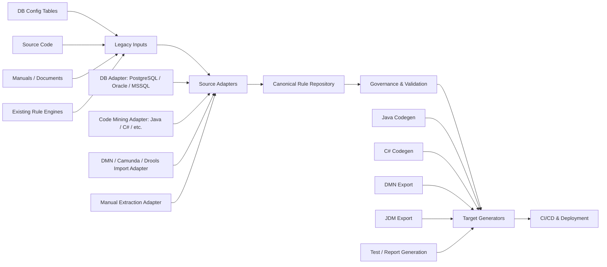

# PRD Update Note — Reconsider GoRules/JDM And Target Architecture

## 1. Background

The previous PRD assumed that a rule engine could be a core runtime component. Under that assumption, selecting GoRules Zen Engine and JDM made sense because:

- JDM is JSON-native and easy to generate programmatically.
- Zen Engine can evaluate decisions at runtime.
- The running application could off-load decision logic to a rule engine.
- Editing rules-as-data could change runtime behavior without rebuilding the legacy application.

However, the confirmed direction has changed. The target is now **source-code generation**, not runtime rule-engine externalization.

The intended flow is:

```text
edit approved rule
→ regenerate source code
→ run build / golden tests
→ deploy generated source
```

Therefore, the rule engine is no longer the production runtime. It may still be useful for preview, simulation, visualization, or migration compatibility, but it should not be the architectural center.

## 2. Core Architecture Decision

### Decision

Do **not** use GoRules/JDM, DMN, or any engine-native format as the system of record.

Use a lightweight, vendor-neutral **Canonical Rule IR** / **Canonical Rule Model** as the internal source of truth.

External rule formats and engines should be handled through adapters:

```text
DMN       = standard import/export format
JDM       = optional GoRules/Zen simulation/export format
Camunda   = legacy rule/process source adapter
Drools    = legacy rule source adapter
ODM       = legacy rule source adapter
Java/C#/etc. = target source-code generation adapters
```

The core product is not a rule engine. The core product is:

```text
Rule Governance + Rule Normalization + Deterministic Source Generation
```

## 3. Revised Product Positioning

The current title/concept “Rule-Engine-Based Source Generation Module” may be misleading because it implies that the rule engine is central.

Recommended renaming:

```text
Rule Repository-Based Source Generation Module
```

or:

```text
Rule Governance & Source Generation Module
```

This better reflects the confirmed direction:

- rules are managed as governed data;
- source code is generated from approved rules;
- rule engines are optional adapters, not mandatory runtime dependencies.

## 4. Why GoRules/JDM Should Not Be Core

GoRules/JDM was a reasonable initial assumption when the architecture looked like:

```text
canonical rules → JDM → Zen Engine → runtime decision
```

But the confirmed architecture is now:

```text
canonical rules → generated source code → deploy
```

This changes the role of GoRules/JDM.

### Keep GoRules/JDM only as optional adapter

GoRules/JDM can still be useful for:

- quick rule preview;
- demo visualization;
- optional simulation;
- test comparison;
- future runtime-externalization option;
- exporting rules to Zen/JDM if a future site wants that.

But it should not be required for MVP core.

### Do not make JDM the internal model

JDM is GoRules-specific. If JDM becomes the internal format, the product becomes indirectly shaped by one engine even though the production target is generated source code. That creates unnecessary coupling.

The system should instead own its internal model and generate JDM only when needed.

## 5. Why DMN Should Not Be Full Canonical Either

DMN is important and should be supported seriously, especially because some legacy customers may already use Camunda, Drools, IBM ODM, or other rule engines.

However, full DMN should not be the internal source of truth.

Reasons:

1. **DMN is broad and heavy.**  
   Full DMN includes FEEL expressions, boxed expressions, DRD, hit policies, nested decisions, and other features that may be unnecessary or difficult to generate source code from.

2. **Legacy sources are not only DMN.**  
   Inputs may include DB config tables, source code, manuals, stored procedures, or engine-native formats. A DMN-first model may not normalize all of these cleanly.

3. **Source-code generation needs extra metadata.**  
   The platform needs source references, confidence, approval status, versioning, target generator metadata, test coverage, generated artifact metadata, and deployment metadata. These are not naturally part of standard DMN.

4. **Full DMN may overcomplicate MVP.**  
   The MVP should support a restricted rule profile that can be reviewed, tested, and generated into source code safely.

### Recommended DMN role

DMN should be treated as:

```text
standard import/export/interchange format
```

not:

```text
internal system of record
```

Recommended flow:

```text
Camunda DMN / Drools DMN / other DMN assets
→ DMN import adapter
→ Canonical Rule IR
→ review / approval / testing
→ generated source code or export target
```

## 6. Proposed Canonical Rule IR v1

Define a small, codegen-friendly internal rule representation.

The first version should focus on deterministic rule structures:

- decision;
- input fields;
- output fields;
- decision table rows;
- conditions;
- actions;
- hit policy;
- lookup references;
- source references;
- confidence;
- status;
- version;
- audit metadata.

Example:

```json
{
  "decisionId": "enrollment_eligibility",
  "decisionName": "Enrollment Eligibility",
  "profile": "RULE_IR_V1",
  "hitPolicy": "FIRST",
  "inputs": [
    {
      "name": "customer.age",
      "type": "number"
    },
    {
      "name": "product.code",
      "type": "string"
    }
  ],
  "outputs": [
    {
      "name": "eligible",
      "type": "boolean"
    },
    {
      "name": "reasonCode",
      "type": "string"
    }
  ],
  "rules": [
    {
      "ruleId": "R001",
      "when": [
        {
          "field": "customer.age",
          "operator": "<",
          "value": 18
        }
      ],
      "then": [
        {
          "field": "eligible",
          "value": false
        },
        {
          "field": "reasonCode",
          "value": "UNDER_AGE"
        }
      ],
      "sourceReferences": [
        {
          "type": "JAVA_SOURCE",
          "repository": "legacy-enrollment",
          "file": "EnrollmentValidator.java",
          "lineStart": 120,
          "lineEnd": 132
        }
      ],
      "confidence": 0.82,
      "status": "PENDING_REVIEW"
    }
  ]
}
```

## 7. Rule IR v1 Supported Profile

The MVP should explicitly define a restricted, safe profile.

Recommended v1 scope:

```text
Rule IR v1:
- decision tables;
- condition/action rules;
- simple operators: =, !=, >, >=, <, <=, IN, NOT_IN, BETWEEN, EXISTS;
- AND / OR condition groups;
- hit policies: FIRST, UNIQUE, COLLECT;
- explicit lookup table references;
- deterministic output assignment;
- source traceability;
- no unrestricted side effects;
- no arbitrary function execution;
- no full FEEL expression support in MVP.
```

This profile is intentionally smaller than full DMN and more general than JDM.

It should be easy to:

- import from DB config tables;
- normalize from Java/C#/other source mining;
- render as decision table UI;
- evaluate with a simple internal evaluator;
- generate source code deterministically;
- export to DMN or JDM if needed.

## 8. Revised Target Architecture

Replace the current “legacy source → extraction → rule repository → rule engine → round-trip deploy” architecture with an adapter-based architecture:

```text
① Legacy Inputs
   - DB config/code tables
   - source code
   - stored procedures
   - manuals/documents
   - existing rule engines: Camunda, Drools, ODM, DecisionRules, DMN, etc.

② Source Adapters
   - DB adapters
   - language mining adapters
   - DMN/engine import adapters
   - document/manual rule-extraction adapters

③ Canonical Rule Repository
   - Canonical Rule IR
   - versioning
   - source traceability
   - confidence
   - approval status
   - audit log

④ Governance & Validation
   - human review
   - maker-checker approval
   - rule diff
   - golden test execution
   - simple internal evaluator
   - optional external simulation adapter

⑤ Target Generators
   - Java source generator
   - C# source generator
   - DMN export adapter
   - JDM export adapter
   - test case generator
   - report generator

⑥ CI/CD & Deployment
   - generated source branch
   - build
   - golden tests
   - PR/release/deploy
```

Mermaid version:



## 9. Adapter-Based Design

Java and PostgreSQL are only the Phase-1 reference implementation.

They must not be described as the product boundary.

Recommended wording:

```text
Java and PostgreSQL are the first PoC adapters only. The product architecture must support pluggable language, database, and legacy-rule-engine adapters from the beginning.
```

### Source adapter interface

Conceptual interface:

```text
SourceAdapter:
- discoverSources()
- extractCandidateRules(source)
- attachSourceReferences()
- return CandidateRule[]
```

Example source adapters:

```text
source-adapters/
  db-postgres
  db-oracle
  db-mssql
  code-java
  code-csharp
  engine-dmn
  engine-camunda
  engine-drools
  engine-odm
  docs-manual
```

### Target generator interface

Conceptual interface:

```text
TargetGenerator:
- supports(ruleProfile, targetConfig)
- generate(ruleSet, targetConfig)
- return GeneratedArtifact
```

Example target generators:

```text
target-generators/
  java-spring
  java-plain
  csharp-dotnet
  dmn-export
  jdm-export
  test-generator
  report-generator
```

## 10. Legacy Rule Engine Handling

Legacy rule engines should be treated as first-class input sources.

### Camunda DMN

If the customer has Camunda DMN decision assets:

```text
Camunda DMN
→ DMN import adapter
→ Canonical Rule IR
→ review / approval
→ source generation or export
```

This is relatively clean for decision tables.

Mapping example:

```text
DMN input columns     → conditions
DMN output columns    → actions / decision outputs
hit policy            → decision strategy
decision id/name      → decision metadata
DRD                   → decision dependency graph
FEEL expressions      → expression nodes / restricted support / manual review
```

### Camunda BPMN

Camunda BPMN must be treated differently.

BPMN is workflow orchestration, not just business rules. It may include:

- user tasks;
- service tasks;
- events;
- gateways;
- external tasks;
- delegate code;
- process variables;
- calls to other systems.

Recommended wording:

```text
The system can import Camunda DMN decision assets directly into the canonical rule model. Camunda BPMN processes require a separate process/decision analysis path because BPMN contains workflow orchestration, not only business rules. BPMN-to-rule conversion should be candidate-only and must require human review.
```

### Drools / ODM / engine-native formats

Other rule engines should be handled via dedicated adapters:

```text
Drools DRL / decision tables
→ Drools import adapter
→ Canonical Rule IR
→ review / approval
→ target generation
```

```text
IBM ODM / other native rule assets
→ engine-specific import adapter
→ Canonical Rule IR
→ review / approval
→ target generation
```

Do not convert engine-native formats directly into production source code without passing through canonical review/governance.

## 11. Internal Evaluator Instead Of Mandatory Runtime Engine

Because production is generated source code, the MVP does not need a full runtime rule engine.

Instead, implement a simple internal evaluator for Rule IR v1:

```text
Rule IR + sample input
→ decision output
```

Use it for:

- previewing edited rules;
- running golden tests before code generation;
- comparing old vs new behavior;
- validating rule consistency;
- showing business users the expected decision result.

External engines such as GoRules Zen can still be plugged in later as optional simulation adapters.

Recommended wording:

```text
The MVP should not require a runtime rule engine. A simple internal evaluator for the restricted Rule IR v1 is sufficient for preview and golden-test validation. GoRules/JDM may remain an optional adapter for simulation, visualization, or future runtime externalization.
```

## 12. Revised Role Of GoRules/JDM

Replace the current “Primary recommendation: GoRules” framing with:

```text
GoRules Zen / JDM is no longer a primary architecture decision because the confirmed production path is source-code generation, not runtime rule-engine execution.

JDM may still be supported as an optional export/simulation format:

Canonical Rule IR
→ JDM export adapter
→ Zen Engine for preview/simulation/demo

However, JDM must not be the internal system of record and the MVP must not depend on Zen Engine for production behavior.
```

## 13. Revised Role Of DMN

Add:

```text
DMN is the preferred standard interchange format for legacy rule-engine migration where available, especially for Camunda DMN and other DMN-compliant engines.

However, full DMN is not the internal source of truth. The system imports DMN into the Canonical Rule IR, applies governance/review/versioning/testing, and then generates the target artifact.
```

Recommended flow:

```text
DMN / engine-native rule asset
→ import adapter
→ Canonical Rule IR
→ review / approval
→ target generator
```

Not:

```text
DMN → JDM → production
```

and not:

```text
DMN as internal database model
```

## 14. PRD Sections To Update

### Section 1 — Track Summary

Emphasize that this is a governed source-generation platform, not a runtime rule-engine platform.

Suggested addition:

```text
The confirmed target is source-code generation and deployment. A runtime rule engine may be used for preview, validation, simulation, or compatibility, but it is not the production runtime and not the core system dependency.
```

### Section 2 — Relationship To Existing Project

Replace references that imply “rule-engine integration + JDM code generation” is central.

Suggested wording:

```text
New components include a canonical rule repository, source/engine import adapters, rule mining, governance workflow, validation/golden-test execution, and deterministic source-code generators. Runtime rule engines such as GoRules/Zen are optional adapters, not mandatory core components.
```

### Section 4 — Terminology

Add terms:

```text
Canonical Rule IR / Canonical Rule Model — the platform-owned, vendor-neutral rule representation used as the governed source of truth.

Source Adapter — a plug-in that extracts candidate rules from DBs, source code, manuals, DMN, or legacy rule engines.

Target Generator — a plug-in that generates target artifacts such as Java source, C# source, DMN, JDM, test cases, or reports.

Internal Evaluator — a lightweight evaluator for the restricted Rule IR profile used for preview and golden tests.
```

Revise “Rule engine”:

```text
Rule engine — an optional runtime/simulation component that can evaluate generated rule formats such as JDM or DMN. It is not the core production runtime in the confirmed source-generation path.
```

### Section 5.2 — Extraction To Candidate Rules

Update external rule engine path:

```text
External rule engine / DMN → import adapter → Canonical Rule IR. This path supports Camunda DMN, Drools/DMN, and other rule-engine assets where available. BPMN/process assets require a separate process/decision analysis path and should remain candidate-only with mandatory human review.
```

### Section 5.3 — Rule Repository

Clarify that the repository stores Canonical Rule IR, not JDM/DMN.

Suggested wording:

```text
The rule repository stores the platform-owned Canonical Rule IR as the source of truth. DMN, JDM, Java, C#, and other target formats are generated artifacts, not primary storage formats.
```

### Section 5.4 — Rule Engine Execution

Replace this section with:

```text
### 5.4 Validation, Simulation, And Test Execution

The system validates approved and candidate rules using golden test cases and a lightweight internal evaluator for the restricted Rule IR profile. External rule engines such as GoRules Zen, DMN runtimes, Drools, or other engines may be integrated as optional simulation/compatibility adapters, but they are not required for production execution in the confirmed source-generation path.
```

### Section 5.5 — Round-Trip And Deploy

Keep Option B as confirmed target.

Clarify:

```text
Since Option B is confirmed, “deploy” means generating source code, running build/tests, and deploying through the target system’s CI/CD pipeline. Rule-engine publishing is optional and not the primary deployment path.
```

### Section 6 — Architecture

Replace the five-layer pipeline with the new six-layer adapter architecture:

```text
Legacy Inputs
→ Source Adapters
→ Canonical Rule Repository
→ Governance & Validation
→ Target Generators
→ CI/CD & Deployment
```

### Section 7 — Rule Engine Selection

Rename this section to:

```text
Rule Representation And Runtime Strategy
```

Replace vendor-first recommendation with:

```text
Because the confirmed production path is source-code generation, runtime rule-engine selection is secondary. The primary architecture decision is the internal Canonical Rule IR and the adapter model around it.

GoRules/JDM, DMN runtimes, Drools, Camunda, IBM ODM, and other engines should be treated as import/export/simulation adapters rather than the system of record.
```

### Section 8 — Non-Functional Requirements

Add:

```text
- Vendor neutrality: no rule-engine-native format should become the system of record.
- Adapter extensibility: language, DBMS, and legacy rule-engine support must be added through adapters.
- Deterministic generation: production source code must be generated by deterministic templates/AST-based generators, not free-form LLM code generation.
- Safe evaluation: MVP validation should use a restricted Rule IR profile and golden tests.
```

### Section 9 — Phasing

Revise Phase 0:

```text
Phase 0 — Design & samples:
- finalize Canonical Rule IR v1;
- define the restricted rule profile;
- define source adapter and target generator contracts;
- obtain Java/PostgreSQL sample materials for the first PoC;
- confirm whether any legacy rule-engine assets such as Camunda DMN exist.
```

Revise Phase 1:

```text
Phase 1 — PoC reference adapters:
- Java source adapter;
- PostgreSQL config-table adapter;
- Canonical Rule IR repository;
- simple internal evaluator;
- Java source generator;
- golden test execution;
- generated source diff / branch / PR.
```

Success criterion:

```text
Editing one approved rule regenerates source code, passes golden tests, and produces a reviewable generated source diff or PR. No runtime rule engine is required for production validation.
```

Revise Phase 2:

```text
Phase 2 — Productize adapters:
- add second DBMS or second language adapter;
- add DMN/Camunda import adapter if sample assets exist;
- harden governance, audit, versioning, and generator contracts.
```

Revise Phase 3:

```text
Phase 3 — Scale:
- broader language/DB/engine adapters;
- stored procedure mining;
- UI validation mining;
- optional JDM/GoRules simulation adapter;
- optional DMN export adapter.
```

## 15. Updated Architecture Summary

The revised architecture should be summarized as:

```text
This product is a rule-governance and source-generation platform. It ingests legacy logic from databases, source code, manuals, and existing rule engines through pluggable source adapters. All extracted logic is normalized into a vendor-neutral Canonical Rule IR, reviewed through governance workflows, validated with golden tests, and then emitted through target generators such as Java source, C# source, DMN, JDM, reports, or test cases. Since the confirmed production path is generated source code, runtime rule engines are optional adapters rather than core dependencies.
```

## 16. Final Decision Statement

Use this as the architecture decision record:

```text
ADR: Do not use GoRules/JDM or any rule-engine-native format as the core system of record.

Decision:
Use a lightweight, vendor-neutral Canonical Rule IR as the internal source of truth. Treat GoRules/JDM, DMN, Camunda, Drools, ODM, and other rule-engine formats as adapters for import, export, simulation, or migration compatibility.

Rationale:
The confirmed production path is source-code generation, not runtime rule-engine execution. The product must support multiple legacy languages, DBMSs, and old rule engines. Therefore, the core architecture should optimize for normalization, governance, testability, and deterministic code generation rather than for one rule-engine runtime.

Consequences:
- GoRules/JDM is optional, not core.
- DMN is a standard interchange format, not the internal canonical database model.
- Java/PostgreSQL are Phase-1 reference adapters only.
- The MVP can use a simple internal evaluator instead of a full runtime rule engine.
- The hardest and most valuable components are the Canonical Rule IR, source adapters, governance model, golden tests, and deterministic source generators.
```
